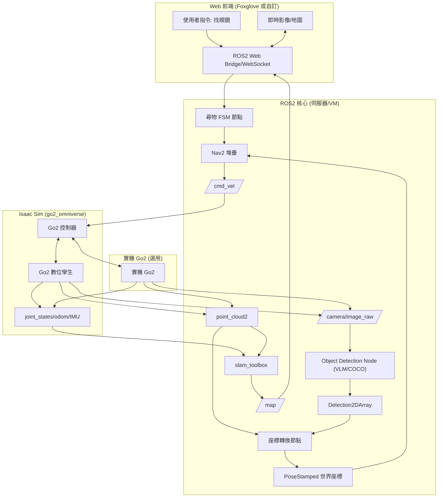

# Go2 智慧尋物系統計畫符合度檢查與修正規劃

**報告日期：** 2025/11/20（依 2025/11/19 會議決議同步）  
**分析基礎：** [Goal.md](./Goal.md)（目標計畫） vs [claude_plan.md](./claude_plan.md)（現況報告） vs go2_omniverse/README.md（模擬器專案） vs 2025/11/19 會議記錄

## 1. 計畫符合度評估
| 項目 | [Goal.md](./Goal.md) 目標 | 現況（2025/11/19 會議） | 符合度 | 修正方向 |
|------|------------------------|---------------------------|--------|------------|
| **基礎建設 (ROS2 + SDK)** | Ubuntu 22.04 + ROS2 Humble + Clean Arch | 95%（程式齊備，但 WSL2 pip/網路仍需固定化流程） | ✅ 高 | 依會議結論，優先完成虛擬機 + ROS2 部署 SOP，確保全員能在 11/26 前複製環境 |
| **SLAM + Nav2** | slam_toolbox + Nav2 完整整合 | 100%（robot.launch.py 已穩定，Nav2 巡邏腳本可用） | ✅ 完備 | 依決議將結果納入 12/17 Demo 的最低保證（實機/模擬任一） |
| **感測器整合** | LiDAR/Camera/IMU 可輸出到 VLM/SLAM | 95%（topic 鏈路完整，TF 補償就緒） | ✅ 高 | 需補上 camera remap + 訂閱手冊（寫入 01-guides） |
| **模擬器** | Isaac Sim (Orbit) 作為主要測試場域 | 進度 20%：go2_omniverse 方案確認，但 Isaac Sim 尚未部署到遠端 GPU | ⚠️ 中 | 依 11/19 會議：柏翊 11/26 前完成 VM→GPU→Isaac Sim 串接，文件同步到 remote GPU setup |
| **VLM 視覺** | Plan A：COCO 本地推論；Plan B：Gemini API | 30%：COCO 研究進行中、Gemini 仍在候補 | ⚠️ 中 | 依決議：W6-W7 完成 COCO 本地推論節點，Gemini 留作 Demo 備案 |
| **座標轉換** | 2D 像素 → 3D 世界 (LiDAR 深度 + tf2) | 僅有 camera_info/TF 基礎 | ❌ 低 | 11/19 決議列為核心技術，W7-W8 需完成 LiDAR 投影與 tf2 結合 Nav2 目標 |
| **尋物邏輯** | FSM (巡邏→掃描→導航) | 0%，僅有簡易巡邏節點 | ❌ 低 | 依會議：W9 建立完整 FSM，納入 12/17 技術展示 |
| **Web / App 介面** | 最少提供 Web 端視覺化與指令 | 30%（Foxglove Bridge） | ⚠️ 中 | 會議決議：優先做桌面 Web 版，12/10 前完成初版畫面（結果 + 指令） |
| **資料記錄 / 分析** | 搜尋紀錄 + 統計 | 0% | ⚠️ 低 | 當前放入第二階段，只需在文件標注延伸規劃 |
| **總體** | 12/17 第一階段 Demo、12/12 文件繳交 | 約 55% | 🟡 中等 | 會議結論：以技術展示為主，立即補齊 VLM/轉換/FSM/模擬四缺口 |

**結論：** 現況高度符合 [Goal.md](./Goal.md) 的基礎與導航範疇，但 11/19 會議已明確將「虛擬機 + 遠端 GPU + Isaac Sim」、「COCO VLM」、「座標轉換」、「尋物 FSM」列為接下來四週必達項目；必須在文件、節點與 Demo 整體同步落地，才能滿足 12/17 技術展示。

## 2. 修正後系統架構圖 (整合 go2_omniverse)

## 3. 更新時程規劃（依 2025/11/19 會議決議）

| 日期區間 | 決議重點 | Must-have 交付 | Owner / 備註 |
|----------|----------|----------------|---------------|
| **11/19 - 11/26** | 完成虛擬機 + 遠端 GPU + Isaac Sim 部署，並整理 SOP | ✅ Windows VM ↔ GPU 連線、✅ ROS2 + go2_robot_sdk 在 VM 編譯、✅ Isaac Sim/go2_omniverse 可啟動並與 ROS2 溝通 | 柏翊負責環境建置；同步更新 [remote_gpu_setup.md](../01-guides/remote_gpu_setup.md) |
| **11/21 - 12/03** | COCO VLM Plan A 雛形 | ✅ 本地 GPU 推論腳本、✅ vision_vlm COCO 節點輸出 Detection2DArray、✅ 影像 topic remap 指南 | 如薇、旭；Gemini API 僅維持候補 |
| **11/28 - 12/05** | 座標轉換基礎 | ✅ LiDAR 投影 + tf2 往 `base_link` → `map` 的轉換、✅ PoseStamped → Nav2 目標範例 | 依會議納入核心技術，與柏翊導航任務共同開發 |
| **12/02 - 12/09** | 尋物 FSM 端到端 | ✅ 巡邏/掃描/鎖定/導航四狀態、✅ 透過 COCO + 轉換產生 Nav2 目標的閉環測試（模擬優先） | 全組共筆，FSM 詳細行為寫入 `docs/02-design/search_fsm_design.md` |
| **12/10 (二)** | 文件完成 | ✅ `docs/` 全面更新（尤其 Goal/README/設計文件 + Ch2 User Story + Ch3 DB Schema） | 11/19 會議決議 |
| **12/11 (三)** | 文件修正日 | ✅ 依指導老師/內部審查修訂 |  |
| **12/12 (四)** | 正式繳交 | ✅ 提交完整文件與 Demo 計畫 |  |
| **12/13 - 12/17** | 第一階段發表準備 | ✅ Demo 腳本、✅ 架構圖（Mermaid/draw.io 動態流向）、✅ 模擬或實機影片 | 發表時間暫定 12/17 中午/五六節 |

## 4. 模擬器整合具體步驟 (go2_omniverse)
1. 安裝 Ubuntu 22.04 + NVIDIA Driver 545+ + Isaac Sim 2023.1.1 (Omniverse Launcher 或 Docker)。
2. 安裝 ROS2 Humble + Orbit 0.3.0 (`./orbit.sh --install --extra rsl_rl`)。
3. `git clone https://github.com/abizovnuralem/go2_omniverse --recurse-submodules` 到專案外目錄。
4. 複製 Unitree_L1.json & material_files 到 Orbit 路徑。
5. `./run_sim.sh` (Go2) 或 `./run_sim_g1.sh`，WASD 控制，驗證 ROS2 topic (camera/lidar/imu/cmd_vel)。
6. 串接：go2_omniverse ROS2 ws src 加 go2_interfaces，colcon build，launch robot.launch.py + sim bridge。
7. 驗證：SLAM/Nav2 在 Sim 環境建圖導航。

## 5. 資源確認清單
| 項目 | 需求 | 狀態（11/19 會議） | 行動 |
|------|------|------------------|------|
| GPU 伺服器 | ✅ **Quadro RTX 8000 48GB（遠端 SSH）** | ✅ 已確認、可供多人使用 | 柏翊維護帳號，提供 VM/SSH 配置文件 |
| 虛擬機 / 網路 | WSL2 + Windows VM + Ubuntu | ⚠️ 代理/pip 網路不穩 | 依決議建立 `setup_ros.sh`、`start_go2_navigation.sh`，並在 docs/01-guides 記錄 proxy/Python 安裝順序 |
| Isaac Sim / go2_omniverse | 2023.1.1 + Orbit 0.3.0 | ❌ 待部署 | 11/26 前完成部署，並可與 ROS2 bridge 驗證（含 SOP） |
| Gemini API | 開發額度 10K/月 | Waiting List | 維持申請，必要時以 COCO Demo 取代 |
| Web / App 服務 | 最低 Web 版（顯示影像/地圖/狀態） | ⚠️ 初版未完成 | 12/10 文件凍結前產出頁面範例，若使用 Foxglove 需寫明操作 |
| 實機降噪 | 腳套/泡棉 測試噪音 | ❌ 未驗證 | 11/26 前購買椅腳套/泡棉試驗，減輕 Demo 場地噪音（柏翊/全組） |

## 6. 風險管理 (Plan A/B/C)
| 風險 | 等級 | 緩解 | Plan B (Demo) | Plan C (最低) |
|------|------|------|---------------|---------------|
| 座標誤差 | 🔴 高 | LiDAR 投影 + 多點平均 | 導大致區域 + Web 標 VLM BBox | COCO + 手動導航 |
| Isaac Sim 阻 | 🔴 高 | 跟 README 步驟，Docker 備援 | 實機 SLAM/Nav2 + 預錄 VLM | 純實機無 VLM |
| VLM 延遲 | 🟡 中 | 快取 + 降頻 (1Hz) | 預錄結果 + 實機導航 | COCO 80類 |
| ROS2/pip | 🟡 中 | proxy/Docker | Docker compose up | 手動依賴 |

**總結：** 依 11/19 會議決議，短期內必須先解決環境與模擬器部署，再在 12/10 文件凍結前依序交付 COCO VLM、座標轉換與尋物 FSM。只要每週依表完成交付，12/17 技術展示便能以「模擬器 + 技術火力」為主軸，並可視實機狀態補上加分項。
