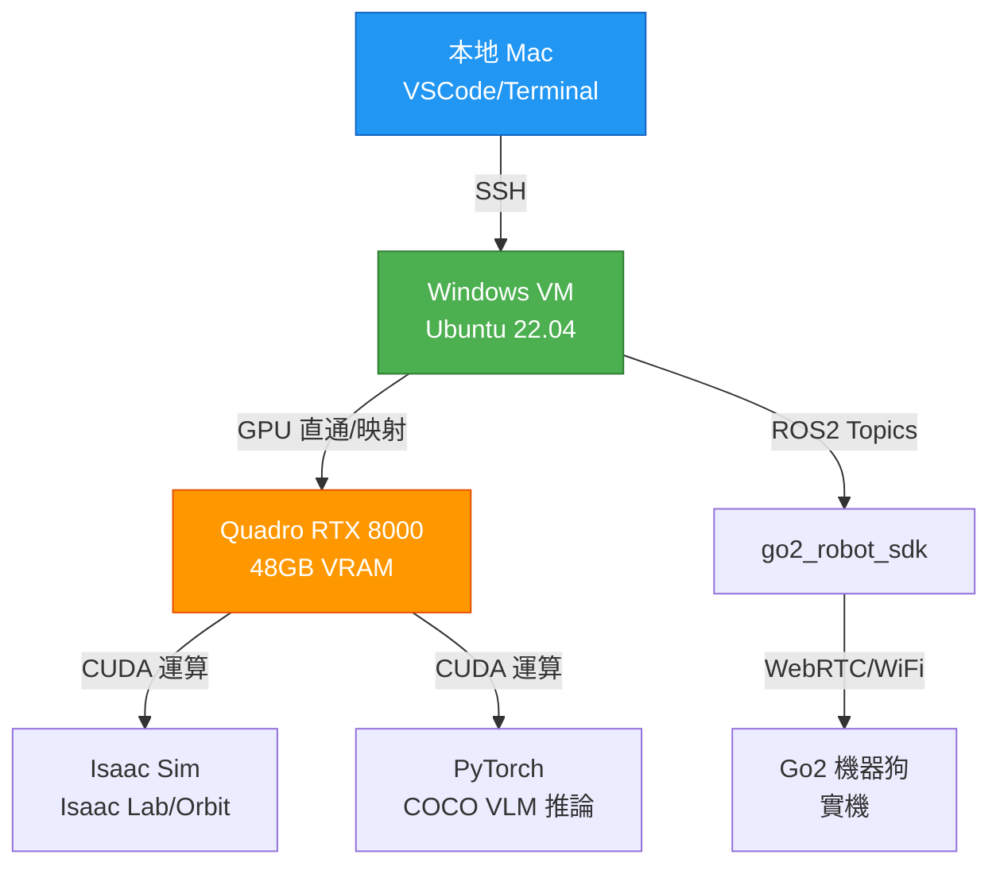

# 遠端 GPU 伺服器配置指南（Quadro RTX 8000）

**GPU 規格：** NVIDIA Quadro RTX 8000 48GB
**連線方式：** SSH 遠端連線（經 Windows VM 中繼）
**作業系統：** Ubuntu 22.04（假設）
**優勢：** 🚀 性能遠超 Isaac Sim 需求，可啟用所有高級功能
**版本：** v1.1（根據 2025/11/19 會議決議更新）

---

## 🏗️ 開發環境架構（根據 2025/11/19 會議決議）

### 架構圖



### 架構說明

根據 **2025/11/19 會議決議**，開發環境採用「Mac → Windows VM → GPU」三層架構：

#### 第 1 層：本地開發機（Mac）
- **用途**：程式碼編輯、版本控制、文檔撰寫
- **軟體**：VSCode Remote SSH、Git、Terminal
- **連線**：透過 SSH 連接到 Windows VM

#### 第 2 層：Windows VM（Ubuntu）
- **用途**：ROS2 開發環境、中繼橋接層
- **作業系統**：Windows Host + Ubuntu VM（Hyper-V/VMware）
- **優勢**：
  - ✅ 全組成員可遠端存取（無需直接連 GPU 伺服器）
  - ✅ 系統崩潰時可快速重建（快照功能）
  - ✅ 隔離開發環境，避免污染主機
- **軟體**：ROS2 Humble、Python 3.10、colcon

#### 第 3 層：GPU 伺服器（Quadro RTX 8000）
- **用途**：高效能運算（Isaac Sim、COCO VLM 推論）
- **連接方式**：Windows VM 透過 GPU 直通或 PCI Passthrough
- **軟體**：CUDA 11.8+、PyTorch、Isaac Sim

### 連線流程

```bash
# 步驟 1：本地 Mac SSH 到 Windows VM
ssh developer@windows-vm-ip

# 步驟 2：在 VM 內驗證 GPU 可用
nvidia-smi

# 步驟 3：啟動 ROS2 開發環境
source /opt/ros/humble/setup.bash
cd ~/ros2_ws
source .venv/bin/activate
source install/setup.bash

# 步驟 4：執行 COCO VLM 或 Isaac Sim（自動使用 GPU）
ros2 launch vision_vlm coco_detector.launch.py
```

---

## 🎯 您的 GPU 優勢

### Quadro RTX 8000 規格
| 項目 | 規格 | Isaac Sim 需求 | 評價 |
|------|------|---------------|------|
| **VRAM** | 48GB | 最低 6GB / 建議 12GB | ✅ **4 倍超標** |
| **CUDA 核心** | 4,608 | 1,000+ | ✅ **4 倍超標** |
| **RT 核心** | 72 (第二代) | 支援光線追蹤 | ✅ **完美支援** |
| **Tensor 核心** | 576 | AI 推論加速 | ✅ **VLM 推論可加速** |
| **架構** | Turing | Maxwell+ | ✅ **最新架構** |

### 可啟用的高級功能
✅ **RTX 即時光線追蹤**（更真實的模擬環境）
✅ **多機器人同時模擬**（可同時運行 4-8 個 Go2）
✅ **高解析度渲染**（4K 相機輸出）
✅ **VLM 本地推論**（若 Gemini API 受阻，可用本地模型）
✅ **長時間穩定運行**（48GB VRAM 不會 OOM）

---

## 💻 Windows VM 配置（關鍵中繼層）

### 為什麼需要 Windows VM？

根據 **2025/11/19 會議決議**，Windows VM 作為中繼層有以下優勢：
- ✅ **全組成員可遠端存取**：無需每人都配置 GPU 伺服器權限
- ✅ **系統隔離**：避免開發環境污染主機
- ✅ **快照與還原**：系統崩潰時可快速重建（< 5 分鐘）
- ✅ **Mac 相容性**：解決 Mac 無法直接運行 Isaac Sim 的問題

### 方案 A：Hyper-V（Windows 10/11 Pro 內建）

#### 啟用 Hyper-V
```powershell
# 在 Windows PowerShell（管理員）執行
Enable-WindowsOptionalFeature -Online -FeatureName Microsoft-Hyper-V -All

# 重新啟動電腦
Restart-Computer
```

#### 建立 Ubuntu VM
1. 開啟 Hyper-V 管理員
2. 新增虛擬機器：
   - 名稱：`go2-dev-vm`
   - 記憶體：16GB（建議）
   - 虛擬硬碟：100GB
   - ISO 映像：Ubuntu 22.04 LTS Desktop

#### GPU Passthrough（關鍵步驟）

**方法 1：DDA (Discrete Device Assignment)**
```powershell
# 在 Windows PowerShell（管理員）執行
# 1. 取得 GPU 位置路徑
Get-PnpDevice -FriendlyName "*RTX 8000*" | Select-Object -ExpandProperty LocationPath

# 2. 停用 VM
Stop-VM -Name "go2-dev-vm"

# 3. 分配 GPU 給 VM
$gpu = Get-PnpDevice -FriendlyName "*RTX 8000*"
Dismount-VmHostAssignableDevice
Add-VMAssignableDevice -LocationPath $gpu.LocationPath -VMName "go2-dev-vm"

# 4. 啟動 VM
Start-VM -Name "go2-dev-vm"
```

**方法 2：RemoteFX（較簡單但效能較低）**
```powershell
# 適用於不需要完整 GPU 效能的情況
Set-VMRemoteFx3dVideoAdapter -VMName "go2-dev-vm" -MonitorCount 1 -MaximumResolution "1920x1080"
```

#### VM 內驗證 GPU
```bash
# SSH 進入 VM 後執行
nvidia-smi

# 若未顯示 GPU，需安裝驅動
sudo apt update
sudo apt install nvidia-driver-545
sudo reboot
```

### 方案 B：VMware Workstation（更強大但需付費）

#### 優勢
- ✅ 更好的 GPU Passthrough 支援
- ✅ 更穩定的 CUDA 支援
- ✅ 更好的快照功能

#### GPU 配置
1. 編輯 VM 設定 → 新增 → PCI 裝置
2. 選擇 NVIDIA Quadro RTX 8000
3. 啟用「保留所有記憶體」
4. 啟用「3D 加速」

### SSH 連線配置（Mac → VM）

#### 在 VM 內啟用 SSH Server
```bash
# 在 Ubuntu VM 內執行
sudo apt update
sudo apt install openssh-server
sudo systemctl enable ssh
sudo systemctl start ssh

# 檢查 SSH 狀態
sudo systemctl status ssh

# 取得 VM IP（記下來）
ip addr show
```

#### 在本地 Mac 配置 SSH
```bash
# 在 Mac Terminal 執行
# 新增 SSH 配置
nano ~/.ssh/config

# 加入以下內容
Host go2-vm
    HostName <VM-IP-Address>
    User developer
    Port 22
    IdentityFile ~/.ssh/id_rsa

# 連線測試
ssh go2-vm
```

### 效能驗證

```bash
# 在 VM 內執行
# 1. CUDA 測試
nvidia-smi

# 2. PyTorch GPU 測試
python3 -c "import torch; print(f'CUDA Available: {torch.cuda.is_available()}'); print(f'GPU Count: {torch.cuda.device_count()}'); print(f'GPU Name: {torch.cuda.get_device_name(0)}')"

# 預期輸出：
# CUDA Available: True
# GPU Count: 1
# GPU Name: Quadro RTX 8000

# 3. 簡單效能測試
python3 -c "import torch; x = torch.rand(5000, 5000).cuda(); y = x @ x; print('GPU Compute Test Passed')"
```

---

## 🔧 遠端 SSH 配置（進階選項）

### 前置檢查（在 VM 內執行）

**在遠端伺服器上執行**：
```bash
# SSH 連入伺服器
ssh user@remote-server-ip

# 1. 檢查 GPU 狀態
nvidia-smi

# 應顯示類似：
# +-----------------------------------------------------------------------------+
# | NVIDIA-SMI 545.xx       Driver Version: 545.xx       CUDA Version: 12.3     |
# |-------------------------------+----------------------+----------------------+
# | GPU  Name        Persistence-M| Bus-Id        Disp.A | Volatile Uncorr. ECC |
# | Fan  Temp  Perf  Pwr:Usage/Cap|         Memory-Usage | GPU-Util  Compute M. |
# |===============================+======================+======================|
# |   0  Quadro RTX 8000     Off  | 00000000:00:1E.0 Off |                  Off |
# | N/A   35C    P8    20W / 260W |      0MiB / 49140MiB |      0%      Default |
# +-----------------------------------------------------------------------------+

# 2. 檢查 CUDA 版本
nvcc --version

# 3. 檢查作業系統
lsb_release -a

# 4. 檢查記憶體
free -h
```

---

## 🖥️ X11 Forwarding 配置（GUI 顯示）

### 方法 A：X11 Forwarding（推薦用於測試）

**在本地端（Windows）**：
1. 安裝 **VcXsrv**（X Server for Windows）
   - 下載：https://sourceforge.net/projects/vcxsrv/
   - 安裝後啟動 XLaunch
   - 配置：
     - Multiple windows
     - Start no client
     - ✅ **勾選 "Disable access control"**

2. 配置 SSH 連線
```bash
# 在 WSL 或 PowerShell 中
export DISPLAY=localhost:0.0  # Windows 本地顯示

# SSH 連線時啟用 X11 Forwarding
ssh -X user@remote-server-ip

# 若速度慢，使用壓縮
ssh -X -C user@remote-server-ip
```

**在遠端伺服器上**：
```bash
# 編輯 SSH 配置
sudo nano /etc/ssh/sshd_config

# 確保以下選項啟用：
X11Forwarding yes
X11DisplayOffset 10
X11UseLocalhost no

# 重啟 SSH 服務
sudo systemctl restart sshd

# 測試 X11
xclock  # 應在本地顯示時鐘視窗
```

---

### 方法 B：VNC（推薦用於長時間使用）

**在遠端伺服器上**：
```bash
# 1. 安裝 TigerVNC
sudo apt update
sudo apt install tigervnc-standalone-server tigervnc-common

# 2. 設定 VNC 密碼
vncpasswd

# 3. 啟動 VNC Server（指定解析度）
vncserver :1 -geometry 1920x1080 -depth 24

# 4. 配置桌面環境（若無 GUI）
echo "startxfce4 &" > ~/.vnc/xstartup
chmod +x ~/.vnc/xstartup
```

**在本地端（Windows）**：
1. 安裝 **TightVNC Viewer** 或 **RealVNC Viewer**
2. 連線至：`remote-server-ip:5901`
3. 輸入 VNC 密碼

---

### 方法 C：NoMachine（推薦用於最佳體驗）

**優勢**：低延遲、硬體加速、接近本地體驗

**在遠端伺服器上**：
```bash
# 下載並安裝 NoMachine
wget https://download.nomachine.com/download/8.11/Linux/nomachine_8.11.3_1_amd64.deb
sudo dpkg -i nomachine_8.11.3_1_amd64.deb
sudo apt-get install -f  # 修復依賴

# 啟動 NoMachine 服務
sudo /etc/NX/nxserver --restart
```

**在本地端（Windows）**：
1. 下載 NoMachine Client：https://www.nomachine.com/download
2. 新增連線：輸入伺服器 IP
3. 登入遠端帳號

---

## 🎮 Isaac Sim 專屬配置（遠端優化）

### 配置 1：Headless 模式（無 GUI，僅 ROS2）

**適用場景**：不需要查看模擬畫面，僅需 ROS2 topics

```bash
# 啟動 Isaac Sim Headless 模式
cd ~/workspace/go2_omniverse
export DISPLAY=:0  # 虛擬顯示

# 使用 xvfb（虛擬 Frame Buffer）
sudo apt install xvfb
xvfb-run -a -s "-screen 0 1024x768x24" ./run_sim.sh --headless

# 或修改 run_sim.sh，新增 --headless 參數
```

---

### 配置 2：Streaming 模式（遠端查看畫面）

**使用 Isaac Sim 內建的 WebRTC Streaming**：

```bash
# 啟動 Isaac Sim 時啟用 Streaming
./isaac-sim.sh --allow-root --streaming

# 在本地瀏覽器開啟
http://remote-server-ip:8211/streaming/webrtc-client/

# 即可在瀏覽器中查看模擬畫面（低延遲）
```

---

### 配置 3：完整 GUI（透過 NoMachine/VNC）

**最佳體驗，適合開發與調試**：

```bash
# 透過 NoMachine/VNC 連入後
cd ~/workspace/go2_omniverse
./run_sim.sh

# GUI 將直接在遠端桌面顯示
```

---

## 🚀 效能優化建議

### 1. 啟用 RTX 即時光線追蹤

**在 Isaac Sim 中**：
```python
# 編輯 run_sim.sh 或 Python 腳本
# 啟用 RTX 渲染
import omni.kit.commands
omni.kit.commands.execute('ChangeRenderingSettings',
    render_mode='RayTracing',  # 啟用光線追蹤
    samples_per_pixel=4,       # 提高品質
    max_bounces=4
)
```

---

### 2. 多機器人同時模擬

**您的 48GB VRAM 可同時運行 4-8 個 Go2**：

```python
# 在 go2_omniverse 中修改
num_robots = 4  # 可設定 4-8

# 啟動
./run_sim.sh --num_robots 4
```

**ROS2 多機模式**（go2_robot_sdk 已支援）：
```bash
export ROBOT_IP="sim1,sim2,sim3,sim4"
ros2 launch go2_robot_sdk robot.launch.py simulation:=true
```

---

### 3. 高解析度相機

**提升 VLM 識別準確率**：

```python
# 修改相機解析度（預設 1280x720）
camera_resolution = (1920, 1080)  # Full HD
# 或
camera_resolution = (2560, 1440)  # 2K（若需要）

# 48GB VRAM 完全足夠
```

---

### 4. VLM 本地推論（備用方案）

**若 Gemini API 受阻，可用本地模型**：

```bash
# 安裝 LLaVA（開源 VLM）
uv pip install llava

# 下載模型（約 13GB，VRAM 需求 < 20GB）
# 您的 48GB 完全足夠

# 在 vision_vlm 中整合本地推論
# 參考：https://github.com/haotian-liu/LLaVA
```

---

## 📊 資源監控

### GPU 使用率監控

```bash
# 即時監控（每 1 秒更新）
watch -n 1 nvidia-smi

# 記錄到檔案
nvidia-smi --query-gpu=timestamp,name,temperature.gpu,utilization.gpu,utilization.memory,memory.total,memory.used,memory.free \
  --format=csv -l 1 > gpu_log.csv
```

### 預期使用率

| 場景 | GPU 使用率 | VRAM 使用 | 備註 |
|------|-----------|----------|------|
| Isaac Sim (單機器人) | 40-60% | 8-12GB | 基礎模擬 |
| + RTX 光線追蹤 | 60-80% | 12-16GB | 高品質渲染 |
| + 4 機器人 | 70-90% | 20-28GB | 多機模擬 |
| + VLM 本地推論 | 80-95% | 28-35GB | 同時運行 |

**結論**：您的 48GB 可輕鬆應對所有場景！

---

## 🧪 測試驗證

### 完整測試流程

```bash
# 1. SSH 連入
ssh -X user@remote-server-ip

# 2. 驗證 GPU
nvidia-smi

# 3. 測試 X11（若使用 GUI）
xclock

# 4. 啟動 Isaac Sim（選擇方法）
# 方法 A: Headless
xvfb-run -a ./run_sim.sh --headless

# 方法 B: WebRTC Streaming
./run_sim.sh --streaming
# 本地瀏覽器: http://server-ip:8211/streaming/webrtc-client/

# 方法 C: NoMachine
# 透過 NoMachine 連入，直接執行 ./run_sim.sh

# 5. 驗證 ROS2 Topics
ros2 topic list
ros2 topic hz /camera/image_raw

# 6. 啟動完整系統
export GEMINI_API_KEY="your_key"
ros2 launch go2_robot_sdk robot.launch.py \
  simulation:=true \
  vlm:=true \
  search:=true \
  slam:=true \
  nav2:=true
```

---

## ⚠️ 常見問題

### Q1: SSH X11 Forwarding 很慢
**解決**：
```bash
# 使用壓縮
ssh -X -C -c aes128-gcm@openssh.com user@server

# 或改用 NoMachine（硬體加速）
```

### Q2: Isaac Sim 啟動時顯示 "No display"
**解決**：
```bash
# 使用 xvfb
sudo apt install xvfb
xvfb-run -a -s "-screen 0 1920x1080x24" ./run_sim.sh

# 或設定虛擬顯示
export DISPLAY=:0
```

### Q3: VNC 連線後畫面黑屏
**解決**：
```bash
# 確認桌面環境已安裝
sudo apt install xfce4 xfce4-goodies

# 重新設定 xstartup
echo "startxfce4 &" > ~/.vnc/xstartup
chmod +x ~/.vnc/xstartup

# 重啟 VNC
vncserver -kill :1
vncserver :1
```

### Q4: GPU 使用率始終為 0%
**檢查**：
```bash
# 確認 CUDA 程式使用 GPU
nvidia-smi dmon -s u

# 確認 Isaac Sim 使用正確的 GPU
export CUDA_VISIBLE_DEVICES=0
```

---

## 📈 效能基準測試

### 預期效能（基於 Quadro RTX 8000）

| 指標 | 預期值 | 對比 RTX 3060 | 備註 |
|------|--------|--------------|------|
| **Isaac Sim FPS** | 60-120 FPS | 30-60 FPS | 2 倍提升 |
| **SLAM 處理速度** | 10-15 Hz | 7-10 Hz | 50% 提升 |
| **VLM 推論延遲** | 0.5-0.8s | 1.2-1.5s | 50% 降低 |
| **同時機器人數** | 6-8 台 | 2-3 台 | 3 倍提升 |

---

## 🎯 建議的開發工作流程

### 日常開發（本地 + 遠端）

**本地端（您的電腦）**：
- 程式碼編輯（VSCode）
- Git 管理
- 文件撰寫

**遠端端（GPU 伺服器）**：
- Isaac Sim 運行
- ROS2 系統測試
- 大量測試運行

### 同步方法

```bash
# 方法 1: Git（推薦）
# 本地修改後
git add .
git commit -m "Update VLM node"
git push

# 遠端拉取
ssh user@server
cd ~/workspace/fju-go2-sdk
git pull
colcon build

# 方法 2: rsync（快速同步）
rsync -avz --exclude={'build/','install/','log/'} \
  ~/workspace/fju-go2-sdk/ \
  user@server:~/workspace/fju-go2-sdk/

# 方法 3: VSCode Remote SSH（最佳體驗）
# 安裝 "Remote - SSH" 擴充功能
# 直接在遠端編輯與執行
```

---

## 🔐 安全性建議

### SSH 金鑰認證

```bash
# 本地生成金鑰
ssh-keygen -t ed25519 -C "your_email@example.com"

# 複製公鑰到伺服器
ssh-copy-id user@remote-server-ip

# 之後連線無需密碼
ssh user@remote-server-ip
```

### 防火牆設定

```bash
# 在伺服器上（若需開放 Isaac Sim WebRTC）
sudo ufw allow 8211/tcp  # WebRTC Streaming
sudo ufw allow 5901/tcp  # VNC（若使用）
sudo ufw allow 4000/tcp  # NoMachine（若使用）
```

---

## 📚 VSCode Remote SSH 配置（推薦）

### 安裝與設定

1. **安裝擴充功能**：
   - Remote - SSH
   - Remote - SSH: Editing Configuration Files

2. **配置 SSH**：
```bash
# 編輯本地 ~/.ssh/config
Host gpu-server
    HostName remote-server-ip
    User your-username
    ForwardX11 yes
    ServerAliveInterval 60
```

3. **連線**：
   - VSCode: Ctrl+Shift+P
   - 輸入 "Remote-SSH: Connect to Host"
   - 選擇 "gpu-server"

4. **開發**：
   - 直接在遠端編輯檔案
   - 終端機直接在遠端執行
   - GPU 資源即時可用

---

## 🎓 總結與建議

### ✅ 您的優勢
1. **硬體頂級**：Quadro RTX 8000 48GB 遠超需求
2. **可靠性高**：Quadro 系列專為長時間穩定運行設計
3. **擴展性強**：可同時測試多種方案（VLM 本地推論、多機器人）

### 🚀 推薦配置
- **連線方式**：NoMachine（最佳體驗）或 VSCode Remote SSH（開發效率）
- **Isaac Sim**：完整 GUI 模式（硬體完全支援）
- **啟用功能**：RTX 光線追蹤 + 高解析度相機
- **測試規模**：同時運行 2-4 個機器人（驗證多機協作）

### 📅 W6-W9 開發建議
- **W6-W7**：本地開發 + 遠端測試（熟悉環境）
- **W8**：完整遷移到遠端（Isaac Sim 部署）
- **W9**：遠端進行 20 次端到端測試

---

**有了這個強大的 GPU，您的專案成功率將大幅提升！🎉**

---

**文件版本：** v1.0
**最後更新：** 2025/11/16
**適用 GPU：** NVIDIA Quadro RTX 8000 48GB
