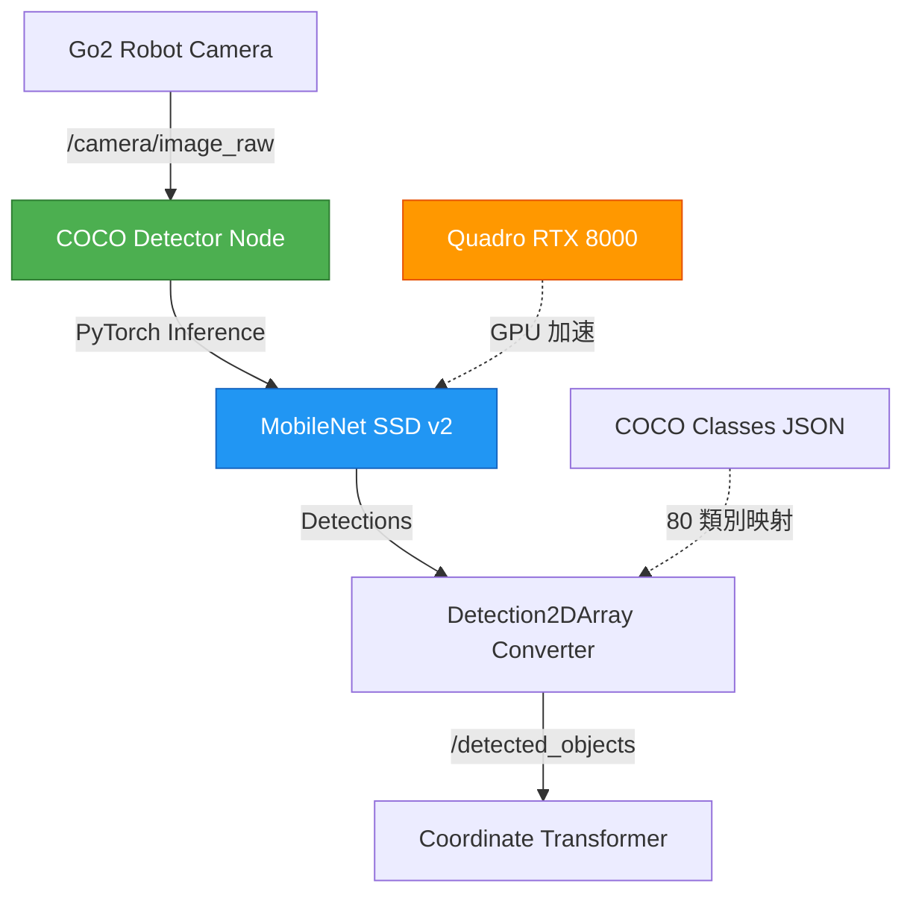

# COCO VLM 整合開發文件（Plan A 主力方案）

**版本**：v1.0
**建立日期**：2025/11/20
**最後更新**：2025/11/20
**狀態**：🟢 主力開發方案（根據 2025/11/19 會議決議）

---

## 目錄

1. [方案概述](#方案概述)
2. [技術架構](#技術架構)
3. [環境建置](#環境建置)
4. [COCO 模型整合](#coco-模型整合)
5. [ROS2 節點實作](#ros2-節點實作)
6. [測試與驗證](#測試與驗證)
7. [效能優化](#效能優化)
8. [故障排除](#故障排除)

---

## 方案概述

### 為什麼選擇 COCO？

根據 **2025/11/19 會議決議**，COCO 模型被選為主力 VLM 方案，原因如下：

#### ✅ 優勢

1. **完全自主控制**
   - 無需依賴外部 API（Gemini 審核中，不確定性高）
   - 不受網路限制，適合實機展示（12/17 發表）
   - 無 API 額度限制

2. **硬體資源充足**
   - Quadro RTX 8000 48GB 完全支援訓練與推論
   - 本地 GPU 推論延遲可控（< 0.5 秒）

3. **已有基礎**
   - COCO 資料集包含 80 種常見物品類別
   - Go2 SDK 文件中已提及支援 COCO Detector
   - PyTorch 生態系統成熟

4. **適合 12/17 發表**
   - 實機展示無需網路
   - 可離線運行
   - 效果可預測、可控

#### ⚠️ 劣勢與應對

| 劣勢 | 影響 | 應對方案 |
|------|------|---------|
| 需要標註資料 | 若要微調模型 | 階段一使用預訓練權重即可 |
| 開發時間較長 | W6-W7 時程緊迫 | 使用現成 torchvision 模型 |
| 識別類別固定 | 僅限 COCO 80 類 | 涵蓋常見物品（眼鏡、遙控器、鑰匙等） |

### 備案方案

- **Plan B**：Gemini Robotics API（審核中，見 `gemini_vlm_backup.md`）
- **Plan C**：OpenAI/Claude Vision API（最後手段）

---

## 技術架構

### 系統架構圖



### 資料流向

```
┌─────────────────┐
│  Go2 Camera     │
│  (720p/1080p)   │
└────────┬────────┘
         │ sensor_msgs/Image
         ▼
┌─────────────────────────────┐
│  COCO Detector Node         │
│  ┌──────────────────────┐   │
│  │ 1. Image Preprocessing│   │
│  │    - Resize to 640x640│   │
│  │    - Normalize        │   │
│  └───────────┬──────────┘   │
│              ▼              │
│  ┌──────────────────────┐   │
│  │ 2. PyTorch Inference  │   │
│  │    - MobileNet SSD v2 │   │
│  │    - Confidence > 0.5 │   │
│  └───────────┬──────────┘   │
│              ▼              │
│  ┌──────────────────────┐   │
│  │ 3. NMS Filtering      │   │
│  │    - IoU threshold    │   │
│  └───────────┬──────────┘   │
│              ▼              │
│  ┌──────────────────────┐   │
│  │ 4. Detection2DArray   │   │
│  │    - Bounding boxes   │   │
│  │    - Class labels (中文)│  │
│  └──────────────────────┘   │
└──────────┬──────────────────┘
           │ vision_msgs/Detection2DArray
           ▼
┌─────────────────────┐
│ Coordinate          │
│ Transformer Node    │
└─────────────────────┘
```

---

## 環境建置

### 硬體需求

| 組件 | 最低需求 | 推薦配置 | 本專案配置 |
|------|---------|---------|-----------|
| GPU | GTX 1060 (6GB) | RTX 3060 (12GB) | **Quadro RTX 8000 (48GB)** ✅ |
| RAM | 8GB | 16GB | 充足 |
| 儲存空間 | 10GB | 20GB | 充足 |

### 軟體環境

**作業系統**：Ubuntu 22.04 LTS
**Python**：3.10
**ROS2**：Humble
**CUDA**：11.8+ (與 PyTorch 版本對應)

### 依賴安裝

#### 1. 安裝 PyTorch 與 TorchVision

```bash
# 檢查 CUDA 版本
nvidia-smi

# 安裝 PyTorch (CUDA 11.8 範例)
uv pip install torch==2.1.0 torchvision==0.16.0 --index-url https://download.pytorch.org/whl/cu118

# 驗證安裝
python3 -c "import torch; print(f'PyTorch: {torch.__version__}'); print(f'CUDA Available: {torch.cuda.is_available()}')"
```

**預期輸出**：
```
PyTorch: 2.1.0+cu118
CUDA Available: True
```

#### 2. 安裝 ROS2 依賴

```bash
# 安裝 vision_msgs
sudo apt-get install ros-humble-vision-msgs

# 或使用 rosdep
cd /Users/lubaiyu/elder_and_dog
rosdep install --from-paths src --ignore-src -r -y
```

#### 3. 安裝其他依賴

```bash
# 切換到專案目錄
cd /Users/lubaiyu/elder_and_dog

# 建立 COCO VLM 專用依賴檔
cat > src/vision_vlm/requirements-coco.txt <<EOF
torch==2.1.0
torchvision==0.16.0
numpy==1.24.4
opencv-python==4.8.1.78
Pillow==10.1.0
EOF

# 安裝依賴（使用 uv）
uv pip install -r src/vision_vlm/requirements-coco.txt
```

---

## COCO 模型整合

### COCO 80 類別清單

COCO 資料集包含 80 種常見物品，涵蓋老人尋物的主要場景：

<details>
<summary>點擊展開完整類別清單（繁體中文映射）</summary>

```python
COCO_CLASSES = {
    1: "人", 2: "腳踏車", 3: "汽車", 4: "機車", 5: "飛機",
    6: "公車", 7: "火車", 8: "卡車", 9: "船", 10: "紅綠燈",
    11: "消防栓", 13: "停止標誌", 14: "停車收費表", 15: "長椅", 16: "鳥",
    17: "貓", 18: "狗", 19: "馬", 20: "羊", 21: "牛",
    22: "大象", 23: "熊", 24: "斑馬", 25: "長頸鹿", 27: "背包",
    28: "雨傘", 31: "手提包", 32: "領帶", 33: "行李箱", 34: "飛盤",
    35: "滑雪板", 36: "滑雪板", 37: "運動球", 38: "風箏", 39: "棒球棒",
    40: "棒球手套", 41: "滑板", 42: "衝浪板", 43: "網球拍", 44: "瓶子",
    45: "酒杯", 46: "杯子", 47: "叉子", 48: "刀", 49: "湯匙",
    50: "碗", 51: "香蕉", 52: "蘋果", 53: "三明治", 54: "橘子",
    55: "花椰菜", 56: "紅蘿蔔", 57: "熱狗", 58: "披薩", 59: "甜甜圈",
    60: "蛋糕", 61: "椅子", 62: "沙發", 63: "盆栽植物", 64: "床",
    67: "餐桌", 70: "馬桶", 72: "電視", 73: "筆記型電腦", 74: "滑鼠",
    75: "遙控器", 76: "鍵盤", 77: "手機", 78: "微波爐", 79: "烤箱",
    80: "烤麵包機", 81: "水槽", 82: "冰箱", 84: "書", 85: "時鐘",
    86: "花瓶", 87: "剪刀", 88: "泰迪熊", 89: "吹風機", 90: "牙刷"
}

# 老人尋物高頻物品（根據需求文件）
HIGH_PRIORITY_OBJECTS = [
    "遙控器",  # ID: 75
    "手機",    # ID: 77
    "眼鏡",    # 需額外訓練或使用 Gemini 備案
    "鑰匙",    # 需額外訓練或使用 Gemini 備案
    "藥瓶",    # "瓶子" ID: 44 可部分涵蓋
    "杯子",    # ID: 46
    "書",      # ID: 84
]
```

**注意**：眼鏡、鑰匙不在 COCO 80 類中，需要：
1. 使用 Gemini API 作為補充（Plan B）
2. 或進行 COCO 模型微調（第二階段）

</details>

### 模型選擇

#### 推薦：MobileNet SSD v2

```python
import torch
from torchvision.models.detection import ssdlite320_mobilenet_v3_large
from torchvision.models.detection import SSDLite320_MobileNet_V3_Large_Weights

# 載入預訓練模型
weights = SSDLite320_MobileNet_V3_Large_Weights.COCO_V1
model = ssdlite320_mobilenet_v3_large(weights=weights)
model.eval()

# 移至 GPU
device = torch.device('cuda' if torch.cuda.is_available() else 'cpu')
model = model.to(device)

print(f"模型載入成功，運行於: {device}")
```

**選擇理由**：
- ✅ 輕量級（約 3.5M 參數）
- ✅ 推論速度快（~30 FPS @ RTX 8000）
- ✅ 預訓練於 COCO 資料集
- ✅ TorchVision 官方支援

#### 替代方案：Faster R-CNN

```python
from torchvision.models.detection import fasterrcnn_resnet50_fpn
from torchvision.models.detection import FasterRCNN_ResNet50_FPN_Weights

weights = FasterRCNN_ResNet50_FPN_Weights.COCO_V1
model = fasterrcnn_resnet50_fpn(weights=weights)
model.eval()
```

**優點**：準確率更高
**缺點**：速度較慢（~15 FPS），參數量大（~42M）

**建議**：階段一使用 MobileNet SSD，若準確率不足再升級。

---

## ROS2 節點實作

### 套件結構

```bash
src/vision_vlm/
├── vision_vlm/
│   ├── __init__.py
│   ├── coco_detector_node.py          # 主節點
│   ├── coco_classes.py                # 類別映射
│   └── detection_converter.py         # Detection2DArray 轉換
├── launch/
│   └── coco_detector.launch.py
├── config/
│   └── coco_params.yaml
├── test/
│   └── test_coco_detector.py
├── package.xml
├── setup.py
└── requirements-coco.txt
```

### 核心節點實作

#### `coco_detector_node.py`

```python
#!/usr/bin/env python3
"""
COCO Detector Node - Plan A 主力 VLM 方案
使用 TorchVision 預訓練模型進行物品識別

Author: Go2 智慧尋物團隊
Date: 2025/11/20
"""

import rclpy
from rclpy.node import Node
from sensor_msgs.msg import Image
from vision_msgs.msg import Detection2DArray, Detection2D, ObjectHypothesisWithPose
from cv_bridge import CvBridge
import torch
import torchvision.transforms as T
from torchvision.models.detection import ssdlite320_mobilenet_v3_large
from torchvision.models.detection import SSDLite320_MobileNet_V3_Large_Weights
import numpy as np
from .coco_classes import COCO_CLASSES


class COCODetectorNode(Node):
    """COCO 物品偵測節點"""

    def __init__(self):
        super().__init__('coco_detector_node')

        # 宣告參數
        self.declare_parameter('device', 'cuda')  # 'cuda' or 'cpu'
        self.declare_parameter('confidence_threshold', 0.5)
        self.declare_parameter('nms_iou_threshold', 0.5)
        self.declare_parameter('max_detections', 10)
        self.declare_parameter('input_topic', '/camera/image_raw')
        self.declare_parameter('output_topic', '/detected_objects')

        # 讀取參數
        self.device_name = self.get_parameter('device').value
        self.confidence_threshold = self.get_parameter('confidence_threshold').value
        self.nms_iou_threshold = self.get_parameter('nms_iou_threshold').value
        self.max_detections = self.get_parameter('max_detections').value

        # 初始化 PyTorch 模型
        self.get_logger().info('正在載入 COCO 模型...')
        self.device = torch.device(self.device_name if torch.cuda.is_available() else 'cpu')

        weights = SSDLite320_MobileNet_V3_Large_Weights.COCO_V1
        self.model = ssdlite320_mobilenet_v3_large(weights=weights)
        self.model.eval()
        self.model = self.model.to(self.device)

        self.get_logger().info(f'模型載入成功，運行於: {self.device}')

        # 影像轉換
        self.transform = T.Compose([
            T.ToTensor(),
        ])

        # CV Bridge
        self.bridge = CvBridge()

        # ROS2 訂閱與發佈
        self.subscription = self.create_subscription(
            Image,
            self.get_parameter('input_topic').value,
            self.image_callback,
            10
        )

        self.publisher = self.create_publisher(
            Detection2DArray,
            self.get_parameter('output_topic').value,
            10
        )

        self.get_logger().info('COCO Detector Node 已啟動')

    def image_callback(self, msg: Image):
        """處理接收到的影像"""
        try:
            # 轉換 ROS Image 到 OpenCV
            cv_image = self.bridge.imgmsg_to_cv2(msg, desired_encoding='rgb8')

            # 預處理
            image_tensor = self.transform(cv_image).unsqueeze(0).to(self.device)

            # 推論
            with torch.no_grad():
                predictions = self.model(image_tensor)[0]

            # 轉換為 Detection2DArray
            detections = self.convert_to_detection2d_array(
                predictions,
                msg.header,
                cv_image.shape[:2]
            )

            # 發佈結果
            self.publisher.publish(detections)

            self.get_logger().info(
                f'偵測到 {len(detections.detections)} 個物品',
                throttle_duration_sec=2.0  # 每 2 秒最多顯示一次
            )

        except Exception as e:
            self.get_logger().error(f'處理影像時發生錯誤: {e}')

    def convert_to_detection2d_array(self, predictions, header, image_shape):
        """將 PyTorch 預測結果轉換為 ROS2 Detection2DArray"""
        detections_msg = Detection2DArray()
        detections_msg.header = header

        # 過濾低信心度的偵測
        scores = predictions['scores'].cpu().numpy()
        labels = predictions['labels'].cpu().numpy()
        boxes = predictions['boxes'].cpu().numpy()

        mask = scores >= self.confidence_threshold
        scores = scores[mask][:self.max_detections]
        labels = labels[mask][:self.max_detections]
        boxes = boxes[mask][:self.max_detections]

        height, width = image_shape

        for score, label, box in zip(scores, labels, boxes):
            detection = Detection2D()

            # Bounding box (轉換為歸一化座標)
            detection.bbox.center.position.x = float((box[0] + box[2]) / 2 / width)
            detection.bbox.center.position.y = float((box[1] + box[3]) / 2 / height)
            detection.bbox.size_x = float((box[2] - box[0]) / width)
            detection.bbox.size_y = float((box[3] - box[1]) / height)

            # 物品類別與信心度
            hypothesis = ObjectHypothesisWithPose()
            hypothesis.hypothesis.class_id = COCO_CLASSES.get(int(label), f"未知類別 {label}")
            hypothesis.hypothesis.score = float(score)

            detection.results.append(hypothesis)
            detections_msg.detections.append(detection)

        return detections_msg


def main(args=None):
    rclpy.init(args=args)
    node = COCODetectorNode()

    try:
        rclpy.spin(node)
    except KeyboardInterrupt:
        pass
    finally:
        node.destroy_node()
        rclpy.shutdown()


if __name__ == '__main__':
    main()
```

#### `coco_classes.py`

```python
"""COCO 資料集類別映射（繁體中文）"""

COCO_CLASSES = {
    1: "人", 2: "腳踏車", 3: "汽車", 4: "機車", 5: "飛機",
    6: "公車", 7: "火車", 8: "卡車", 9: "船", 10: "紅綠燈",
    11: "消防栓", 13: "停止標誌", 14: "停車收費表", 15: "長椅", 16: "鳥",
    17: "貓", 18: "狗", 19: "馬", 20: "羊", 21: "牛",
    22: "大象", 23: "熊", 24: "斑馬", 25: "長頸鹿", 27: "背包",
    28: "雨傘", 31: "手提包", 32: "領帶", 33: "行李箱", 34: "飛盤",
    35: "滑雪板", 36: "滑雪板", 37: "運動球", 38: "風箏", 39: "棒球棒",
    40: "棒球手套", 41: "滑板", 42: "衝浪板", 43: "網球拍", 44: "瓶子",
    45: "酒杯", 46: "杯子", 47: "叉子", 48: "刀", 49: "湯匙",
    50: "碗", 51: "香蕉", 52: "蘋果", 53: "三明治", 54: "橘子",
    55: "花椰菜", 56: "紅蘿蔔", 57: "熱狗", 58: "披薩", 59: "甜甜圈",
    60: "蛋糕", 61: "椅子", 62: "沙發", 63: "盆栽植物", 64: "床",
    67: "餐桌", 70: "馬桶", 72: "電視", 73: "筆記型電腦", 74: "滑鼠",
    75: "遙控器", 76: "鍵盤", 77: "手機", 78: "微波爐", 79: "烤箱",
    80: "烤麵包機", 81: "水槽", 82: "冰箱", 84: "書", 85: "時鐘",
    86: "花瓶", 87: "剪刀", 88: "泰迪熊", 89: "吹風機", 90: "牙刷"
}

# 反向映射（繁體中文 → ID）
COCO_CLASSES_ZH_TO_ID = {v: k for k, v in COCO_CLASSES.items()}
```

### Launch 文件

#### `coco_detector.launch.py`

```python
from launch import LaunchDescription
from launch_ros.actions import Node
from launch.actions import DeclareLaunchArgument
from launch.substitutions import LaunchConfiguration


def generate_launch_description():
    return LaunchDescription([
        # 宣告參數
        DeclareLaunchArgument(
            'device',
            default_value='cuda',
            description='推論裝置 (cuda/cpu)'
        ),

        DeclareLaunchArgument(
            'confidence_threshold',
            default_value='0.5',
            description='信心度門檻'
        ),

        # COCO Detector Node
        Node(
            package='vision_vlm',
            executable='coco_detector_node',
            name='coco_detector',
            output='screen',
            parameters=[{
                'device': LaunchConfiguration('device'),
                'confidence_threshold': LaunchConfiguration('confidence_threshold'),
                'input_topic': '/camera/image_raw',
                'output_topic': '/detected_objects',
            }]
        ),
    ])
```

### 參數配置檔

#### `config/coco_params.yaml`

```yaml
coco_detector:
  ros__parameters:
    # 推論裝置
    device: "cuda"  # 可選：cuda, cpu

    # 偵測參數
    confidence_threshold: 0.5      # 信心度門檻（0.0-1.0）
    nms_iou_threshold: 0.5         # NMS IoU 門檻
    max_detections: 10             # 最多偵測數量

    # ROS2 Topics
    input_topic: "/camera/image_raw"
    output_topic: "/detected_objects"

    # 效能優化
    use_fp16: false                # 是否使用 FP16（需 GPU 支援）
    batch_size: 1                  # 批次大小
```

---

## 測試與驗證

### 單元測試

```python
# test/test_coco_detector.py
import unittest
import torch
from vision_vlm.coco_detector_node import COCODetectorNode


class TestCOCODetector(unittest.TestCase):

    def test_model_loading(self):
        """測試模型載入"""
        import rclpy
        rclpy.init()

        node = COCODetectorNode()
        self.assertIsNotNone(node.model)
        self.assertEqual(node.device.type, 'cuda')

        node.destroy_node()
        rclpy.shutdown()

    def test_coco_classes(self):
        """測試 COCO 類別映射"""
        from vision_vlm.coco_classes import COCO_CLASSES, COCO_CLASSES_ZH_TO_ID

        self.assertEqual(COCO_CLASSES[75], "遙控器")
        self.assertEqual(COCO_CLASSES_ZH_TO_ID["手機"], 77)
        self.assertEqual(len(COCO_CLASSES), 80)


if __name__ == '__main__':
    unittest.main()
```

### 整合測試

```bash
# 1. 啟動 Go2 驅動（模擬或實機）
export ROBOT_IP="192.168.1.100"
ros2 launch go2_robot_sdk robot.launch.py

# 2. 啟動 COCO Detector
ros2 launch vision_vlm coco_detector.launch.py

# 3. 檢查偵測結果
ros2 topic echo /detected_objects

# 4. 檢查推論頻率
ros2 topic hz /detected_objects
```

**預期輸出**：
```
average rate: 15.234
  min: 0.065s max: 0.068s std dev: 0.00123s window: 100
```

### 效能測試

```bash
# GPU 記憶體使用監控
watch -n 1 nvidia-smi

# 預期：約 1-2 GB VRAM（MobileNet SSD）
```

---

## 效能優化

### 1. FP16 半精度推論

```python
# 修改 coco_detector_node.py
if self.get_parameter('use_fp16').value and self.device.type == 'cuda':
    self.model = self.model.half()  # 轉換為 FP16
    self.get_logger().info('已啟用 FP16 半精度推論')
```

**效果**：
- ✅ 推論速度提升 ~1.5x
- ✅ VRAM 使用減半
- ⚠️ 準確率可能略降（< 1%）

### 2. TorchScript 編譯

```python
# 在模型載入後
example_input = torch.rand(1, 3, 640, 640).to(self.device)
self.model = torch.jit.trace(self.model, example_input)
self.get_logger().info('已使用 TorchScript 編譯模型')
```

**效果**：
- ✅ 推論速度提升 ~1.2x
- ✅ 更好的 GPU 核心利用率

### 3. 影像降頻

```python
# 不是每幀都推論，而是降頻到 5 Hz
self.last_inference_time = self.get_clock().now()
self.inference_interval = 0.2  # 200ms = 5 Hz

def image_callback(self, msg):
    now = self.get_clock().now()
    if (now - self.last_inference_time).nanoseconds < self.inference_interval * 1e9:
        return  # 跳過此幀

    self.last_inference_time = now
    # ... 正常處理
```

---

## 故障排除

### 問題 1：CUDA Out of Memory

**症狀**：
```
RuntimeError: CUDA out of memory. Tried to allocate 1.50 GiB
```

**解決方案**：
```python
# 1. 使用較小的模型
from torchvision.models.detection import ssd300_vgg16

# 2. 啟用 FP16
model = model.half()

# 3. 清空 GPU 快取
torch.cuda.empty_cache()
```

### 問題 2：推論速度慢

**症狀**：< 5 FPS

**解決方案**：
```bash
# 檢查是否使用 GPU
nvidia-smi

# 確認 model 在 GPU 上
python3 -c "import torch; print(next(model.parameters()).device)"
```

### 問題 3：無法偵測特定物品

**症狀**：眼鏡、鑰匙偵測不到

**解決方案**：
- 這些物品不在 COCO 80 類中
- 需要使用 Gemini API 作為補充（見 `gemini_vlm_backup.md`）
- 或在第二階段進行模型微調

---

## 下一步

1. ✅ **完成 COCO Detector 節點開發**（本文檔）
2. 🟡 **整合座標轉換系統**（見 `coordinate_transformation.md`）
3. 🟡 **端到端測試**（見 `testing_plan.md`）
4. 🟡 **12/17 發表準備**（見 `presentation_1217_plan.md`）

---

## 參考資料

- [TorchVision Detection Models](https://pytorch.org/vision/stable/models.html#object-detection)
- [COCO Dataset](https://cocodataset.org/)
- [ROS2 Vision Messages](https://github.com/ros-perception/vision_msgs)
- [Go2 SDK Documentation](../CLAUDE.md)

---

**文件維護**：本文件由 Go2 智慧尋物團隊維護，如有問題請參考 `docs/README.md`。
