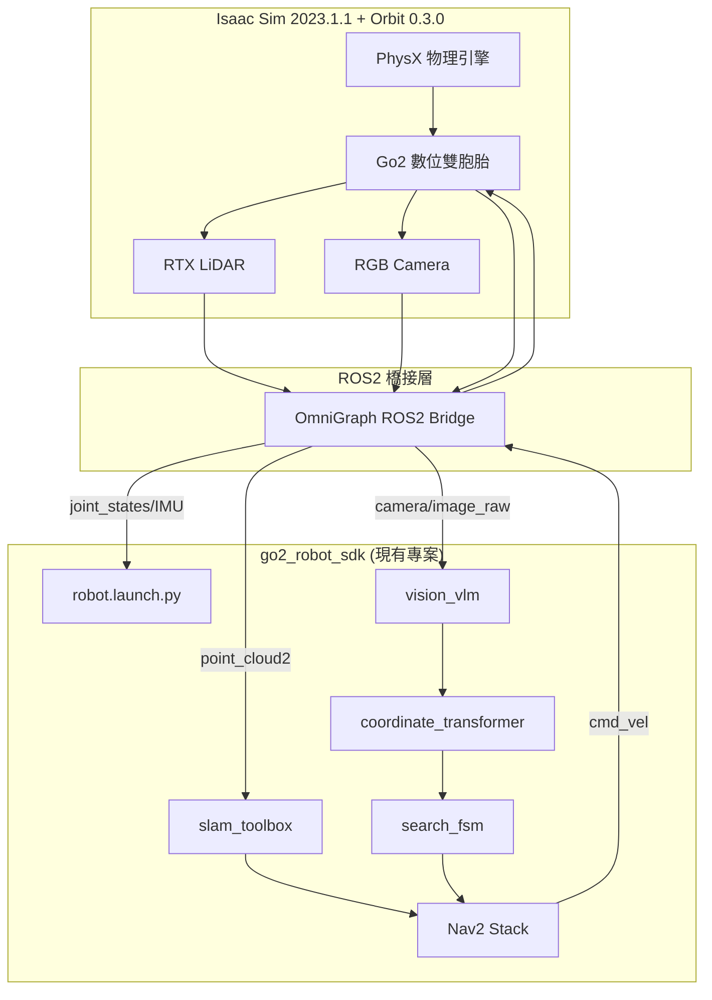

# Isaac Sim + go2_omniverse 整合指南

**目標環境：** NVIDIA Isaac Sim 2023.1.1 + Orbit 0.3.0
**參考專案：** [go2_omniverse](https://github.com/abizovnuralem/go2_omniverse)
**開發週次：** W4, W8
**難度：** ⭐⭐⭐⭐ 高（環境配置複雜）

---

## 📋 目標

部署 **Isaac Sim 數位雙胞胎環境**,與現有 `go2_robot_sdk` 整合，實現：
1. 在模擬器中測試 SLAM/Nav2
2. 驗證 VLM + 座標轉換鏈路
3. 進行端到端尋物系統測試
4. 降低實機測試風險（過熱、損壞）

---

## 🎯 go2_omniverse 功能一覽

### 已實現功能（Roadmap 100%）
✅ PPO 平衡算法
✅ 鍵盤實時控制（WASD）
✅ Camera 串流到 ROS2
✅ RTX LiDAR 串流到 ROS2
✅ IMU 數據串流到 ROS2
✅ URDF 實時關節同步
✅ 腳力感測器數據
✅ ROS2 實時控制
✅ **Nav2 + slam_toolbox 支援** ⭐
✅ 多機器人支援
✅ G1 人形機器人支援

### 與 [Goal.md](../00-overview/Goal.md) 對應
| [Goal.md](../00-overview/Goal.md) 需求 | go2_omniverse 提供 | 狀態 |
|-------------|-------------------|------|
| Isaac Sim (Orbit) | ✅ Isaac Sim 2023.1.1 + Orbit 0.3.0 | 完美匹配 |
| ROS2 Humble | ✅ ROS2 Humble 橋接 | 完美匹配 |
| slam_toolbox | ✅ 已驗證可用 | 完美匹配 |
| Nav2 | ✅ 已驗證可用 | 完美匹配 |
| LiDAR/Camera/IMU | ✅ Unitree L1 LiDAR + RGB Camera | 完美匹配 |

---

## 🏗️ 系統架構

### 整合架構圖



---

## 🛠️ 安裝步驟（詳細版）

### 方法 A：本地安裝（推薦，效能最佳）

#### 前置需求
- **作業系統**：Ubuntu 22.04
- **GPU**：NVIDIA RTX 系列（最低 GTX 1060 6GB，推薦 RTX 3060+）
- **驅動**：NVIDIA Driver 545+
- **記憶體**：32GB RAM 建議
- **儲存空間**：100GB 可用空間

#### Step 1: 安裝 NVIDIA Driver
```bash
# 檢查當前驅動
nvidia-smi

# 若版本 < 545，需更新
sudo apt update
sudo apt install nvidia-driver-545
sudo reboot

# 驗證
nvidia-smi  # 應顯示 Driver Version: 545.xx
```

#### Step 2: 安裝 Miniconda
```bash
# 下載並安裝
wget https://repo.anaconda.com/miniconda/Miniconda3-latest-Linux-x86_64.sh
bash Miniconda3-latest-Linux-x86_64.sh

# 重要：禁用 base 環境自動啟動
conda config --set auto_activate_base false

# 重新載入 shell
source ~/.bashrc
```

#### Step 3: 安裝 Omniverse Launcher + Isaac Sim
```bash
# 方法 1: 使用 Omniverse Launcher（GUI）
# 下載: https://www.nvidia.com/en-us/omniverse/download/
# 安裝後在 Launcher 中搜尋 "Isaac Sim 2023.1.1" 並安裝

# 方法 2: 使用預下載的版本（若 Launcher 無 2023.1.1）
# 參考下方 Docker 方法提取 Isaac Sim 檔案
```

#### Step 4: 安裝 ROS2 Humble
```bash
# 官方安裝指令
sudo apt update && sudo apt install -y \
  software-properties-common curl gnupg lsb-release

sudo curl -sSL https://raw.githubusercontent.com/ros/rosdistro/master/ros.key \
  -o /usr/share/keyrings/ros-archive-keyring.gpg

echo "deb [arch=$(dpkg --print-architecture) signed-by=/usr/share/keyrings/ros-archive-keyring.gpg] \
  http://packages.ros.org/ros2/ubuntu $(lsb_release -cs) main" \
  | sudo tee /etc/apt/sources.list.d/ros2.list > /dev/null

sudo apt update
sudo apt install ros-humble-desktop-full

# 設定環境變數
echo "source /opt/ros/humble/setup.bash" >> ~/.bashrc
source ~/.bashrc

# 安裝必要工具
sudo apt install python3-rosdep python3-colcon-common-extensions

# 初始化 rosdep
sudo rosdep init
rosdep update
```

#### Step 5: 配置 Isaac Sim for ROS2
```bash
# 設定環境變數（加入 ~/.bashrc）
export ISAACSIM_PATH="${HOME}/.local/share/ov/pkg/isaac-sim-2023.1.1"
export ISAACSIM_PYTHON_EXE="${ISAACSIM_PATH}/python.sh"

# 安裝 ROS2 橋接
# 參考: https://docs.omniverse.nvidia.com/isaacsim/latest/installation/install_ros.html

# 測試 Isaac Sim 是否正常
${ISAACSIM_PATH}/isaac-sim.sh
```

#### Step 6: 安裝 IsaacLab (Orbit 0.3.0)
```bash
# 克隆特定版本
cd ~/workspace  # 選擇合適的工作目錄
git clone https://github.com/isaac-sim/IsaacLab.git --branch v0.3.1

cd IsaacLab

# 建立符號連結
ln -s ${ISAACSIM_PATH} _isaac_sim

# 安裝 Orbit
./orbit.sh --conda
conda activate orbit
sudo apt install cmake build-essential
./orbit.sh --install
./orbit.sh --extra rsl_rl

# 驗證安裝
python source/standalone/tutorials/00_sim/create_empty.py
# 應開啟視窗標題: "Isaac Sim Python 2023.1.1 - New Stage*"
```

#### Step 7: 安裝 go2_omniverse
```bash
# 克隆專案
cd ~/workspace
git clone https://github.com/abizovnuralem/go2_omniverse.git \
  --recurse-submodules -j8 --depth=1

cd go2_omniverse

# 複製配置文件
# 1. LiDAR 配置
mkdir -p ~/workspace/IsaacLab/source/data/sensors/lidar
cp Isaac_sim/Unitree/Unitree_L1.json \
   ~/workspace/IsaacLab/source/data/sensors/lidar/

# 2. Material 文件
mkdir -p ~/workspace/IsaacLab/source/data/material_files
cp ${ISAACSIM_PATH}/data/material_files/* \
   ~/workspace/IsaacLab/source/data/material_files/

# 3. 下載自訂環境（可選）
# 從 https://drive.google.com/drive/folders/1vVGuO1KIX1K6mD6mBHDZGm9nk2vaRyj3
# 下載 office.usd / warehouse.usd 等，放入 go2_omniverse/envs/

# 啟動模擬器（不需 conda orbit 環境）
./run_sim.sh  # Go2
# 或
./run_sim_g1.sh  # G1 人形機器人

# 鍵盤控制測試
# WASD: 移動
# 檢查 ROS2 topics:
ros2 topic list
ros2 topic echo /camera/image_raw
ros2 topic echo /scan
ros2 topic echo /cmd_vel
```

---

### 方法 B：Docker 安裝（隔離環境）

#### Step 1: 安裝 Docker + NVIDIA Container Toolkit
```bash
# 安裝 Docker
curl -fsSL https://get.docker.com -o get-docker.sh
sudo sh get-docker.sh
sudo usermod -aG docker $USER
newgrp docker

# 安裝 NVIDIA Container Toolkit
distribution=$(. /etc/os-release;echo $ID$VERSION_ID)
curl -s -L https://nvidia.github.io/libnvidia-container/gpgkey | sudo apt-key add -
curl -s -L https://nvidia.github.io/libnvidia-container/$distribution/libnvidia-container.list \
  | sudo tee /etc/apt/sources.list.d/nvidia-container-toolkit.list

sudo apt update
sudo apt install nvidia-container-toolkit
sudo systemctl restart docker
```

#### Step 2: 拉取 Isaac Sim 2023.1.1 Docker 映像
```bash
docker pull nvcr.io/nvidia/isaac-sim:2023.1.1
```

#### Step 3: 執行容器
```bash
docker run --name isaac-sim --entrypoint bash -it --runtime=nvidia --gpus all \
  -e "ACCEPT_EULA=Y" --rm --network=host \
  -e "PRIVACY_CONSENT=Y" \
  -v ~/docker/isaac-sim/cache/kit:/isaac-sim/kit/cache:rw \
  -v ~/docker/isaac-sim/cache/ov:/root/.cache/ov:rw \
  -v ~/docker/isaac-sim/cache/pip:/root/.cache/pip:rw \
  -v ~/docker/isaac-sim/cache/glcache:/root/.cache/nvidia/GLCache:rw \
  -v ~/docker/isaac-sim/cache/computecache:/root/.nv/ComputeCache:rw \
  -v ~/docker/isaac-sim/logs:/root/.nvidia-omniverse/logs:rw \
  -v ~/docker/isaac-sim/data:/root/.local/share/ov/data:rw \
  -v ~/docker/isaac-sim/documents:/root/Documents:rw \
  nvcr.io/nvidia/isaac-sim:2023.1.1
```

#### Step 4: 提取 Isaac Sim 到本地（若需要）
```bash
# 在另一個終端
docker ps  # 取得容器 ID
docker cp <container_id>:/isaac-sim/. ~/.local/share/ov/pkg/isaac-sim-2023.1.1
```

---

## 🔗 與 go2_robot_sdk 整合

### 策略：雙向 ROS2 通訊

#### 架構說明
- **go2_omniverse** 作為**感測器模擬器**（發佈 LiDAR/Camera/IMU）
- **go2_robot_sdk** 作為**控制與導航系統**（發佈 cmd_vel）
- 透過 ROS2 DDS 自動橋接（同一網域）

#### 整合步驟

**Terminal 1: 啟動 Isaac Sim**
```bash
cd ~/workspace/go2_omniverse
./run_sim.sh

# 等待視窗出現，按 PLAY 按鈕
```

**Terminal 2: 驗證 ROS2 Topics**
```bash
source /opt/ros/humble/setup.bash
ros2 topic list

# 應包含：
# /camera/image_raw
# /camera/camera_info
# /scan
# /point_cloud2  # 若啟用
# /joint_states
# /imu
# /cmd_vel
```

**Terminal 3: 啟動 go2_robot_sdk（修改版）**
```bash
cd ~/workspace/fju-go2-sdk
source install/setup.bash

# 設定為模擬模式（不連接實機）
export ROBOT_IP="sim"
export CONN_TYPE="simulation"

# 啟動 SLAM/Nav2（不啟動驅動節點）
ros2 launch go2_robot_sdk robot.launch.py \
  driver:=false \
  slam:=true \
  nav2:=true \
  rviz2:=true

# 或直接啟動 SLAM/Nav2
ros2 launch slam_toolbox online_async_launch.py
ros2 launch nav2_bringup navigation_launch.py
```

**Terminal 4: 測試導航**
```bash
# 在 RViz 中：
# 1. 設定初始位姿 (2D Pose Estimate)
# 2. 設定導航目標 (2D Nav Goal)

# 或使用指令發送目標
ros2 topic pub /goal_pose geometry_msgs/PoseStamped "{
  header: {frame_id: 'map'},
  pose: {
    position: {x: 2.0, y: 1.0, z: 0.0},
    orientation: {w: 1.0}
  }
}" --once
```

---

### Launch 文件修改（支援模擬模式）

修改 `go2_robot_sdk/launch/robot.launch.py`：

```python
# 新增參數
DeclareLaunchArgument(
    'simulation',
    default_value='false',
    description='使用模擬器（不啟動驅動節點）'
),

# 條件啟動驅動節點
driver_node = Node(
    package='go2_robot_sdk',
    executable='go2_driver_node',
    condition=IfCondition(
        PythonExpression([
            "not ", LaunchConfiguration('simulation')
        ])
    ),
    ...
)
```

啟動範例：
```bash
ros2 launch go2_robot_sdk robot.launch.py \
  simulation:=true \
  slam:=true \
  nav2:=true
```

---

## 🧪 測試場景

### 場景 1：Office 環境（自訂）
```bash
# 修改 run_sim.sh
./run_sim.sh --custom_env=office --terrain flat

# 首次執行需等待 2-3 分鐘載入環境
```

### 場景 2：Warehouse 環境
```bash
./run_sim.sh --custom_env=warehouse --terrain flat
```

### 場景 3：預設地形
```bash
# 平坦地面
./run_sim.sh --terrain flat

# 崎嶇地形（測試運動控制）
./run_sim.sh --terrain rough
```

---

## 📊 效能調整

### 降低延遲
```python
# 在 Isaac Sim 中調整物理頻率
# Edit -> Preferences -> Physics
physics_dt = 1/60  # 從 1/120 降至 1/60
```

### 提高 LiDAR 精度
```json
// Unitree_L1.json
{
  "horizontal_resolution": 0.5,  // 從 1.0 降至 0.5 度
  "num_rows": 16  // 增加掃描線數
}
```

---

## ⚠️ 常見問題

### Q1: `Could not import 'rosidl_typesupport_c' for package`
**解決**：重新安裝 ROS2 依賴
```bash
sudo apt install ros-humble-rosidl-typesupport-c
source /opt/ros/humble/setup.bash
```

### Q2: Isaac Sim 視窗無法開啟（黑屏）
**解決**：檢查 Vulkan 支援
```bash
vulkaninfo | grep "driverVersion"
# 若無輸出，安裝 Vulkan
sudo apt install mesa-vulkan-drivers vulkan-utils
```

### Q3: Topic 延遲過高（> 1 秒）
**解決**：調整 DDS QoS
```bash
# 使用 ROS2 Fast DDS（預設）
export RMW_IMPLEMENTATION=rmw_fastrtps_cpp
```

---

## 📚 參考資源

- [go2_omniverse GitHub](https://github.com/abizovnuralem/go2_omniverse)
- [Isaac Sim 官方文檔](https://docs.omniverse.nvidia.com/isaacsim/latest/)
- [IsaacLab (Orbit) 文檔](https://isaac-orbit.github.io/)
- [ROS2 + Isaac Sim 教學](https://docs.omniverse.nvidia.com/isaacsim/latest/ros2_tutorials/index.html)

---

**文件版本：** v1.0
**最後更新：** 2025/11/16
**預計完成日期：** W8 結束
