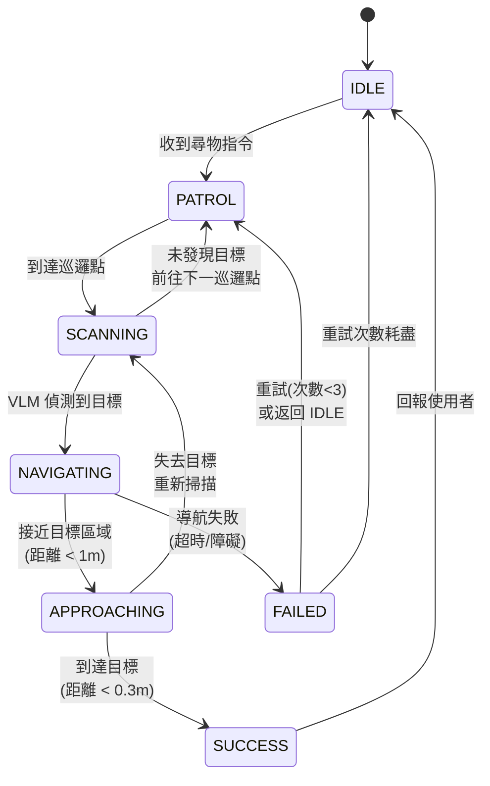

# 尋物狀態機設計文件

**套件名稱：** `search_logic`
**主要節點：** `search_fsm_node`
**開發週次：** W9
**難度：** ⭐⭐⭐ 中等

---

## 📋 目標

開發一個有限狀態機（Finite State Machine, FSM），整合 VLM、座標轉換與 Nav2，實現完整的智慧尋物流程。

---

## 🎯 狀態機設計

### 狀態定義

```python
class SearchState(Enum):
    IDLE = 0           # 閒置等待
    PATROL = 1         # 巡邏掃描
    SCANNING = 2       # 原地旋轉掃描
    NAVIGATING = 3     # 導航至目標
    APPROACHING = 4    # 接近目標（精細調整）
    SUCCESS = 5        # 成功找到
    FAILED = 6         # 失敗重試
```

### 狀態轉移圖



### 狀態詳細說明

#### 1. IDLE（閒置）
**觸發條件**：
- 系統啟動
- 完成上一次尋物任務

**行為**：
- 訂閱 `/search_command` (String)
- 等待使用者輸入（如 "找眼鏡"）

**轉移**：
- 收到指令 → PATROL

---

#### 2. PATROL（巡邏）
**目的**：系統性掃描環境，增加發現目標的機率。

**行為**：
```python
# 定義巡邏路徑點（可從地圖中預設）
patrol_points = [
    (2.0, 1.0),   # 客廳中央
    (4.0, 2.5),   # 沙發區
    (1.5, 4.0),   # 書桌旁
    (3.5, 0.5)    # 入口處
]

# 循環訪問各點
current_goal = patrol_points[patrol_index]
send_nav2_goal(current_goal)
```

**觸發 VLM 掃描**：
- 每到達一個巡邏點，轉為 SCANNING 狀態
- VLM 以較高頻率（2 Hz）識別目標

**轉移**：
- 到達巡邏點 → SCANNING
- 所有巡邏點都訪問過仍未找到 → FAILED

---

#### 3. SCANNING（原地掃描）
**目的**：在巡邏點原地旋轉 360°，讓 VLM 掃描所有方向。

**行為**：
```python
# 發送旋轉指令（cmd_vel）
angular_velocity = 0.3  # rad/s
rotation_duration = 2 * pi / angular_velocity  # 約 20 秒

# 或使用 Nav2 發送相同位置但不同朝向的目標
for angle in [0, 90, 180, 270]:  # 度
    goal_pose = current_position.copy()
    goal_pose.orientation = euler_to_quaternion(0, 0, angle)
    send_nav2_goal(goal_pose)
```

**VLM 監聽**：
- 訂閱 `/detected_objects`
- 檢查是否有目標物（比對 `class_id` 與使用者指令）

**轉移**：
- VLM 偵測到目標 → NAVIGATING
- 掃描完畢未發現 → PATROL（下一個巡邏點）

---

#### 4. NAVIGATING（導航至目標）
**目的**：使用 Nav2 導航到座標轉換輸出的世界座標。

**行為**：
```python
# 訂閱 /object_pose_world
object_world_pose = get_latest_object_pose()

# 發送 Nav2 導航目標
goal_msg = NavigateToPose.Goal()
goal_msg.pose = object_world_pose
nav2_client.send_goal_async(goal_msg, feedback_callback=nav_feedback)
```

**監控**：
- 追蹤導航進度（Nav2 feedback）
- 計算與目標的距離

**轉移**：
- 距離 < 1.0m → APPROACHING
- 導航失敗/超時（> 60s）→ FAILED
- VLM 持續更新目標位置 → 動態調整路徑

---

#### 5. APPROACHING（接近目標）
**目的**：精細調整位置，確保機器狗確實到達目標物旁邊。

**行為**：
```python
# 降低導航速度（修改 Nav2 參數或發送低速 cmd_vel）
max_vel_x = 0.2  # m/s
max_vel_theta = 0.3  # rad/s

# 持續追蹤 VLM 輸出
if object_still_visible:
    # 微調位置
    adjust_position()
else:
    # 失去目標，回到 SCANNING
    transition_to_scanning()
```

**成功條件**：
- 距離目標 < 0.3m（可調整）
- VLM 仍能偵測到目標

**轉移**：
- 滿足成功條件 → SUCCESS
- 失去目標視線 → SCANNING

---

#### 6. SUCCESS（成功）
**行為**：
```python
# 發佈成功訊息
self.result_pub.publish(String(data="成功找到眼鏡！位置：(X, Y)"))

# 播放 TTS（若啟用）
self.tts_pub.publish(String(data="我找到了您的眼鏡"))

# 可選：拍照記錄
save_image_with_bbox()
```

**轉移**：
- 3 秒後 → IDLE

---

#### 7. FAILED（失敗）
**觸發原因**：
- 導航失敗（障礙物阻擋、路徑規劃失敗）
- 巡邏所有點仍未找到
- 座標轉換異常

**行為**：
```python
self.retry_count += 1

if self.retry_count < 3:
    # 重試：回到上一個巡邏點
    transition_to_patrol()
else:
    # 放棄
    self.result_pub.publish(String(data="很抱歉，未能找到目標物"))
    transition_to_idle()
```

---

## 🛠️ 實作細節

### 套件結構

```
src/search_logic/
├── search_logic/
│   ├── __init__.py
│   ├── search_fsm_node.py          # 狀態機主節點
│   ├── state_handlers.py           # 各狀態的處理邏輯
│   ├── nav2_client.py              # Nav2 Action Client 封裝
│   ├── patrol_planner.py           # 巡邏路徑規劃
│   └── vlm_tracker.py              # VLM 結果追蹤器
├── config/
│   └── search_params.yaml
├── test/
│   └── test_state_machine.py
├── launch/
│   └── search.launch.py
├── package.xml
└── setup.py
```

---

### 核心程式碼

#### A. `nav2_client.py`（Nav2 客戶端封裝）

```python
"""
Nav2 Action Client 封裝
簡化導航呼叫介面
"""
import rclpy
from rclpy.action import ActionClient
from rclpy.node import Node
from nav2_msgs.action import NavigateToPose
from geometry_msgs.msg import PoseStamped
from typing import Callable, Optional


class Nav2Client:
    def __init__(self, node: Node):
        self.node = node
        self.client = ActionClient(node, NavigateToPose, 'navigate_to_pose')
        self.goal_handle = None
        self.feedback_callback: Optional[Callable] = None
        self.result_callback: Optional[Callable] = None

    def wait_for_server(self, timeout_sec=5.0):
        """等待 Nav2 服務啟動"""
        return self.client.wait_for_server(timeout_sec=timeout_sec)

    def send_goal(
        self,
        pose: PoseStamped,
        feedback_callback: Optional[Callable] = None,
        result_callback: Optional[Callable] = None
    ):
        """
        發送導航目標

        Args:
            pose: 目標位姿（PoseStamped）
            feedback_callback: 回饋回調函數（接收 feedback 訊息）
            result_callback: 結果回調函數（接收成功/失敗狀態）
        """
        self.feedback_callback = feedback_callback
        self.result_callback = result_callback

        goal_msg = NavigateToPose.Goal()
        goal_msg.pose = pose

        self.node.get_logger().info(
            f'發送導航目標: ({pose.pose.position.x:.2f}, {pose.pose.position.y:.2f})'
        )

        send_goal_future = self.client.send_goal_async(
            goal_msg,
            feedback_callback=self._feedback_callback
        )
        send_goal_future.add_done_callback(self._goal_response_callback)

    def cancel_goal(self):
        """取消當前導航"""
        if self.goal_handle:
            self.node.get_logger().info('取消導航目標')
            cancel_future = self.goal_handle.cancel_goal_async()
            cancel_future.add_done_callback(lambda future: self.node.get_logger().info('導航已取消'))

    def _goal_response_callback(self, future):
        """目標接受回調"""
        self.goal_handle = future.result()
        if not self.goal_handle.accepted:
            self.node.get_logger().error('導航目標被拒絕')
            return

        self.node.get_logger().info('導航目標已接受')
        get_result_future = self.goal_handle.get_result_async()
        get_result_future.add_done_callback(self._get_result_callback)

    def _feedback_callback(self, feedback_msg):
        """導航回饋回調"""
        if self.feedback_callback:
            self.feedback_callback(feedback_msg.feedback)

    def _get_result_callback(self, future):
        """導航結果回調"""
        result = future.result().result
        status = future.result().status

        if self.result_callback:
            success = (status == 4)  # SUCCEEDED = 4
            self.result_callback(success, result)
```

---

#### B. `search_fsm_node.py`（狀態機主節點）

```python
"""
尋物狀態機主節點
"""
import rclpy
from rclpy.node import Node
from std_msgs.msg import String
from geometry_msgs.msg import PoseStamped, Twist
from vision_msgs.msg import Detection2DArray
from enum import Enum
import time
import math

from .nav2_client import Nav2Client


class SearchState(Enum):
    IDLE = 0
    PATROL = 1
    SCANNING = 2
    NAVIGATING = 3
    APPROACHING = 4
    SUCCESS = 5
    FAILED = 6


class SearchFSMNode(Node):
    def __init__(self):
        super().__init__('search_fsm_node')

        # 參數
        self.declare_parameter('patrol_points', [[2.0, 1.0], [4.0, 2.5], [1.5, 4.0]])
        self.declare_parameter('approach_distance', 1.0)  # 切換到 APPROACHING 的距離
        self.declare_parameter('success_distance', 0.3)   # 成功標準距離
        self.declare_parameter('max_retries', 3)
        self.declare_parameter('scan_angular_velocity', 0.3)  # rad/s

        self.patrol_points = self.get_parameter('patrol_points').value
        self.approach_dist = self.get_parameter('approach_distance').value
        self.success_dist = self.get_parameter('success_distance').value
        self.max_retries = self.get_parameter('max_retries').value
        self.scan_angular_vel = self.get_parameter('scan_angular_velocity').value

        # 狀態變數
        self.state = SearchState.IDLE
        self.target_object = ""
        self.patrol_index = 0
        self.retry_count = 0
        self.current_object_pose: PoseStamped = None
        self.robot_pose: PoseStamped = None
        self.scan_start_time = 0.0

        # Nav2 客戶端
        self.nav2_client = Nav2Client(self)
        if not self.nav2_client.wait_for_server():
            self.get_logger().error('Nav2 服務未啟動！')

        # 訂閱器
        self.command_sub = self.create_subscription(
            String,
            '/search_command',
            self.command_callback,
            10
        )

        self.detection_sub = self.create_subscription(
            Detection2DArray,
            '/detected_objects',
            self.detection_callback,
            10
        )

        self.object_pose_sub = self.create_subscription(
            PoseStamped,
            '/object_pose_world',
            self.object_pose_callback,
            10
        )

        # 發佈器
        self.cmd_vel_pub = self.create_publisher(Twist, 'cmd_vel', 10)
        self.result_pub = self.create_publisher(String, '/search_result', 10)

        # 定時器（狀態機更新）
        self.timer = self.create_timer(0.5, self.state_machine_update)

        self.get_logger().info('尋物狀態機已啟動')

    def command_callback(self, msg: String):
        """接收尋物指令"""
        if self.state == SearchState.IDLE:
            self.target_object = msg.data
            self.get_logger().info(f'收到指令：尋找 "{self.target_object}"')
            self.state = SearchState.PATROL
            self.patrol_index = 0
            self.retry_count = 0

    def detection_callback(self, msg: Detection2DArray):
        """處理 VLM 偵測結果"""
        # 檢查是否有目標物
        for detection in msg.detections:
            if detection.results:
                obj_name = detection.results[0].hypothesis.class_id
                if self.target_object.lower() in obj_name.lower():
                    self.get_logger().info(f'VLM 偵測到目標: {obj_name}')
                    # 狀態轉移由 object_pose_callback 處理
                    return

    def object_pose_callback(self, msg: PoseStamped):
        """接收目標物世界座標"""
        self.current_object_pose = msg

        if self.state == SearchState.SCANNING:
            # 發現目標，開始導航
            self.state = SearchState.NAVIGATING
            self.send_navigation_goal(msg)

    def state_machine_update(self):
        """狀態機主循環"""
        if self.state == SearchState.IDLE:
            pass  # 等待指令

        elif self.state == SearchState.PATROL:
            self.handle_patrol()

        elif self.state == SearchState.SCANNING:
            self.handle_scanning()

        elif self.state == SearchState.NAVIGATING:
            self.handle_navigating()

        elif self.state == SearchState.APPROACHING:
            self.handle_approaching()

        elif self.state == SearchState.SUCCESS:
            self.handle_success()

        elif self.state == SearchState.FAILED:
            self.handle_failed()

    def handle_patrol(self):
        """處理巡邏狀態"""
        if self.patrol_index >= len(self.patrol_points):
            # 所有巡邏點都訪問過
            self.get_logger().warn('已巡邏所有點，未找到目標')
            self.state = SearchState.FAILED
            return

        # 發送巡邏點目標
        patrol_point = self.patrol_points[self.patrol_index]
        goal_pose = PoseStamped()
        goal_pose.header.frame_id = 'map'
        goal_pose.header.stamp = self.get_clock().now().to_msg()
        goal_pose.pose.position.x = patrol_point[0]
        goal_pose.pose.position.y = patrol_point[1]
        goal_pose.pose.orientation.w = 1.0

        self.nav2_client.send_goal(
            goal_pose,
            result_callback=self.patrol_result_callback
        )

        self.get_logger().info(f'前往巡邏點 {self.patrol_index + 1}/{len(self.patrol_points)}')
        self.state = SearchState.IDLE  # 暫時等待導航完成（避免重複發送）

    def patrol_result_callback(self, success, result):
        """巡邏點導航結果"""
        if success:
            self.get_logger().info('到達巡邏點，開始掃描')
            self.state = SearchState.SCANNING
            self.scan_start_time = time.time()
        else:
            self.get_logger().warn('巡邏點導航失敗，嘗試下一個點')
            self.patrol_index += 1
            self.state = SearchState.PATROL

    def handle_scanning(self):
        """處理掃描狀態（原地旋轉）"""
        scan_duration = 2 * math.pi / self.scan_angular_vel  # 360 度掃描時間

        if time.time() - self.scan_start_time < scan_duration:
            # 發送旋轉指令
            twist = Twist()
            twist.angular.z = self.scan_angular_vel
            self.cmd_vel_pub.publish(twist)
        else:
            # 掃描完畢，停止旋轉
            self.cmd_vel_pub.publish(Twist())
            self.get_logger().info('掃描完畢，未發現目標，前往下一巡邏點')
            self.patrol_index += 1
            self.state = SearchState.PATROL

    def handle_navigating(self):
        """處理導航狀態"""
        if self.current_object_pose is None:
            return

        # 計算與目標距離
        distance = self.calculate_distance_to_object()

        if distance < self.approach_dist:
            self.get_logger().info('接近目標，切換到精細調整模式')
            self.state = SearchState.APPROACHING

    def handle_approaching(self):
        """處理接近狀態"""
        if self.current_object_pose is None:
            self.get_logger().warn('失去目標，重新掃描')
            self.state = SearchState.SCANNING
            self.scan_start_time = time.time()
            return

        distance = self.calculate_distance_to_object()

        if distance < self.success_dist:
            self.state = SearchState.SUCCESS
        else:
            # 持續調整位置
            self.send_navigation_goal(self.current_object_pose)

    def handle_success(self):
        """處理成功狀態"""
        self.get_logger().info(f'成功找到 "{self.target_object}"！')
        self.result_pub.publish(String(data=f'成功找到 {self.target_object}'))

        # 停止移動
        self.cmd_vel_pub.publish(Twist())

        # 3 秒後回到 IDLE
        time.sleep(3)
        self.state = SearchState.IDLE

    def handle_failed(self):
        """處理失敗狀態"""
        self.retry_count += 1

        if self.retry_count < self.max_retries:
            self.get_logger().warn(f'尋物失敗，重試 ({self.retry_count}/{self.max_retries})')
            self.patrol_index = 0
            self.state = SearchState.PATROL
        else:
            self.get_logger().error('已達最大重試次數，放棄尋物')
            self.result_pub.publish(String(data=f'未能找到 {self.target_object}'))
            self.state = SearchState.IDLE

    def send_navigation_goal(self, pose: PoseStamped):
        """發送導航目標"""
        self.nav2_client.send_goal(
            pose,
            result_callback=self.navigation_result_callback
        )

    def navigation_result_callback(self, success, result):
        """導航結果回調"""
        if not success:
            self.get_logger().warn('導航失敗')
            self.state = SearchState.FAILED

    def calculate_distance_to_object(self) -> float:
        """計算與目標的距離（需實作機器狗位置取得）"""
        # TODO: 從 TF 或 /odom 取得機器狗當前位置
        # 暫時返回假數據
        return 0.5


def main(args=None):
    rclpy.init(args=args)
    node = SearchFSMNode()
    rclpy.spin(node)
    node.destroy_node()
    rclpy.shutdown()
```

---

## 🧪 測試計畫

### 1. 單元測試

```python
# test/test_state_machine.py
import unittest
from search_logic.search_fsm_node import SearchState


class TestStateMachine(unittest.TestCase):
    def test_state_transitions(self):
        # 測試狀態轉移邏輯
        initial_state = SearchState.IDLE
        self.assertEqual(initial_state, SearchState.IDLE)

        # 模擬收到指令
        next_state = SearchState.PATROL
        self.assertEqual(next_state, SearchState.PATROL)
```

### 2. 整合測試

```bash
# 啟動完整系統
ros2 launch go2_robot_sdk robot.launch.py \
  vlm:=true search:=true slam:=true nav2:=true

# 發送尋物指令
ros2 topic pub /search_command std_msgs/String "data: '找眼鏡'" --once

# 監控狀態
ros2 topic echo /search_result
```

---

## 📊 效能指標

| 指標 | 目標值 |
|------|--------|
| **端到端成功率** | > 70% (20 次測試) |
| **平均尋物時間** | < 3 分鐘 |
| **導航成功率** | > 90% |
| **VLM 識別準確率** | > 85% |

---

## 📚 相關資源

- [Nav2 Action 文件](https://navigation.ros.org/tutorials/docs/navigation2_with_rclpy.html)
- [ROS2 狀態機教學](https://design.ros2.org/articles/node_lifecycle.html)

---

**文件版本：** v1.0
**最後更新：** 2025/11/16
