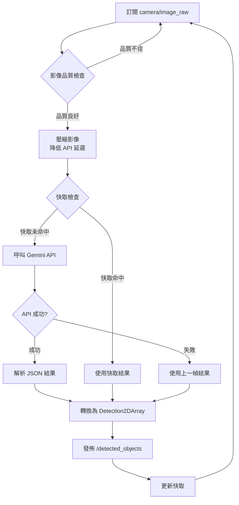

# Gemini VLM 節點開發指南

**套件名稱：** `vision_vlm`
**主要節點：** `gemini_vlm_node`
**開發週次：** W6-W7
**難度：** ⭐⭐⭐ 中等

---

## 📋 目標

開發一個 ROS2 節點，整合 **Google Gemini Robotics VLM API**，實現：
1. 訂閱機器狗相機影像（`camera/image_raw`）
2. 呼叫 Gemini API 進行零樣本物體識別
3. 將識別結果轉換為 ROS2 標準格式（`vision_msgs/Detection2DArray`）
4. 發佈到 `/detected_objects` topic

---

## 🏗️ 系統架構

### 資料流向
```
camera/image_raw (sensor_msgs/Image)
         ↓
  [gemini_vlm_node]
         ↓
  Gemini API Request
  (影像 + Prompt: "找出所有物體及其位置")
         ↓
  Gemini API Response
  {
    "objects": [
      {"name": "眼鏡", "bbox": [x1, y1, x2, y2], "confidence": 0.92},
      {"name": "鑰匙", "bbox": [x3, y3, x4, y4], "confidence": 0.85}
    ]
  }
         ↓
  Detection2DArray Converter
         ↓
/detected_objects (vision_msgs/Detection2DArray)
```

### 節點邏輯流程圖


---

## 📦 套件結構

### 目錄樹
```
src/vision_vlm/
├── vision_vlm/
│   ├── __init__.py
│   ├── gemini_vlm_node.py           # 主節點（核心邏輯）
│   ├── gemini_api_client.py         # Gemini API 包裝類
│   ├── detection_converter.py       # Detection2DArray 轉換工具
│   ├── image_preprocessor.py        # 影像前處理（壓縮、裁剪）
│   └── cache_manager.py             # 快取管理（降低 API 調用）
├── config/
│   └── vlm_params.yaml              # 參數配置
├── test/
│   ├── test_api_client.py           # 單元測試
│   └── test_detection_converter.py
├── launch/
│   └── vlm_standalone.launch.py     # 獨立測試用 launch
├── package.xml
├── setup.py
└── README.md
```

---

## 🛠️ 詳細實作

### 1. 套件建立與依賴

```bash
# 建立套件
cd src/
ros2 pkg create --build-type ament_python vision_vlm \
  --dependencies rclpy sensor_msgs vision_msgs cv_bridge std_msgs

# 安裝額外 Python 依賴
pip install google-generativeai pillow numpy
```

### 2. `package.xml` 配置

```xml
<?xml version="1.0"?>
<?xml-model href="http://download.ros.org/schema/package_format3.xsd" schematypens="http://www.w3.org/2001/XMLSchema"?>
<package format="3">
  <name>vision_vlm</name>
  <version>1.0.0</version>
  <description>Gemini VLM integration for Go2 object detection</description>
  <maintainer email="your@email.com">FJU Go2 Team</maintainer>
  <license>MIT</license>

  <!-- ROS2 依賴 -->
  <depend>rclpy</depend>
  <depend>sensor_msgs</depend>
  <depend>vision_msgs</depend>
  <depend>std_msgs</depend>
  <depend>cv_bridge</depend>
  <depend>geometry_msgs</depend>

  <!-- Python 依賴（需手動 pip install） -->
  <exec_depend>python3-pil</exec_depend>
  <exec_depend>python3-numpy</exec_depend>

  <test_depend>ament_copyright</test_depend>
  <test_depend>ament_flake8</test_depend>
  <test_depend>ament_pep257</test_depend>
  <test_depend>python3-pytest</test_depend>

  <export>
    <build_type>ament_python</build_type>
  </export>
</package>
```

### 3. 核心程式碼

#### A. `gemini_api_client.py`（API 包裝類）

```python
"""
Gemini Robotics API 客戶端
負責與 Google Gemini API 通訊
"""
import google.generativeai as genai
from PIL import Image
import io
import json
from typing import Dict, List, Optional


class GeminiAPIClient:
    def __init__(self, api_key: str, model_name: str = "gemini-2.0-flash-exp"):
        """
        初始化 Gemini API 客戶端

        Args:
            api_key: Gemini API Key
            model_name: 模型名稱（Gemini 2.0 Flash 建議用於機器人應用）
        """
        genai.configure(api_key=api_key)
        self.model = genai.GenerativeModel(model_name)

    def detect_objects(
        self,
        image: Image.Image,
        target_object: Optional[str] = None,
        language: str = "zh-TW"
    ) -> Dict:
        """
        呼叫 Gemini Vision API 進行物體識別

        Args:
            image: PIL Image 物件
            target_object: 特定目標物（如 "眼鏡"），None 則識別所有物體
            language: 回應語言（預設繁體中文）

        Returns:
            {
                "objects": [
                    {
                        "name": "物體名稱",
                        "bbox": [x1, y1, x2, y2],  # 正規化座標 0-1
                        "confidence": 0.95
                    }
                ]
            }
        """
        # 建構 Prompt（使用 Gemini 的物體識別能力）
        if target_object:
            prompt = f"""
你是一個機器人視覺系統。請分析這張圖片，找出 "{target_object}"。

請以 JSON 格式回應（不要包含 markdown 格式符號）：
{{
  "objects": [
    {{
      "name": "物體名稱",
      "bbox": [x1, y1, x2, y2],
      "confidence": 0.0-1.0
    }}
  ]
}}

注意：
- bbox 使用正規化座標（0-1 範圍）
- x1,y1 是左上角，x2,y2 是右下角
- 如果找不到目標物，返回空陣列
- 只回傳 JSON，不要有其他文字
"""
        else:
            prompt = """
你是一個機器人視覺系統。請識別圖片中所有可見的物體。

請以 JSON 格式回應（不要包含 markdown 格式符號）：
{
  "objects": [
    {
      "name": "物體名稱",
      "bbox": [x1, y1, x2, y2],
      "confidence": 0.0-1.0
    }
  ]
}

注意：
- bbox 使用正規化座標（0-1 範圍）
- 優先識別常見家居物品（眼鏡、鑰匙、手機、杯子等）
- 最多回傳 10 個物體
- 只回傳 JSON，不要有其他文字
"""

        try:
            # 呼叫 Gemini API
            response = self.model.generate_content([prompt, image])

            # 解析回應（移除可能的 markdown 符號）
            response_text = response.text.strip()
            if response_text.startswith("```json"):
                response_text = response_text[7:]
            if response_text.startswith("```"):
                response_text = response_text[3:]
            if response_text.endswith("```"):
                response_text = response_text[:-3]

            result = json.loads(response_text.strip())
            return result

        except json.JSONDecodeError as e:
            # JSON 解析失敗，記錄原始回應
            print(f"[ERROR] Gemini API 回應解析失敗: {e}")
            print(f"[DEBUG] 原始回應: {response.text}")
            return {"objects": []}

        except Exception as e:
            print(f"[ERROR] Gemini API 呼叫失敗: {e}")
            return {"objects": []}


# 測試用主程式
if __name__ == "__main__":
    import os

    # 從環境變數讀取 API Key
    api_key = os.getenv("GEMINI_API_KEY")
    if not api_key:
        print("請設定環境變數 GEMINI_API_KEY")
        exit(1)

    # 測試 API
    client = GeminiAPIClient(api_key)

    # 載入測試影像
    test_image = Image.open("test_image.jpg")

    # 測試 1: 識別所有物體
    print("=== 測試 1: 識別所有物體 ===")
    result = client.detect_objects(test_image)
    print(json.dumps(result, indent=2, ensure_ascii=False))

    # 測試 2: 尋找特定物體
    print("\n=== 測試 2: 尋找眼鏡 ===")
    result = client.detect_objects(test_image, target_object="眼鏡")
    print(json.dumps(result, indent=2, ensure_ascii=False))
```

---

#### B. `detection_converter.py`（格式轉換工具）

```python
"""
Detection2DArray 轉換工具
將 Gemini API 結果轉換為 ROS2 vision_msgs 格式
"""
from vision_msgs.msg import Detection2D, Detection2DArray, ObjectHypothesisWithPose
from sensor_msgs.msg import Image
from typing import Dict, List


class DetectionConverter:
    @staticmethod
    def gemini_to_detection2d_array(
        gemini_result: Dict,
        header,
        image_width: int,
        image_height: int
    ) -> Detection2DArray:
        """
        轉換 Gemini API 結果為 Detection2DArray

        Args:
            gemini_result: Gemini API 回應 {"objects": [...]}
            header: ROS2 Header（時間戳、frame_id）
            image_width: 影像寬度（像素）
            image_height: 影像高度（像素）

        Returns:
            Detection2DArray 訊息
        """
        detections = Detection2DArray()
        detections.header = header

        for obj in gemini_result.get("objects", []):
            detection = Detection2D()

            # 設定 Header
            detection.header = header

            # 解析 Bounding Box（正規化座標 → 像素座標）
            bbox_norm = obj.get("bbox", [0, 0, 0, 0])
            x1 = int(bbox_norm[0] * image_width)
            y1 = int(bbox_norm[1] * image_height)
            x2 = int(bbox_norm[2] * image_width)
            y2 = int(bbox_norm[3] * image_height)

            # 計算中心點與尺寸
            center_x = (x1 + x2) / 2.0
            center_y = (y1 + y2) / 2.0
            size_x = x2 - x1
            size_y = y2 - y1

            # 設定 BoundingBox2D
            detection.bbox.center.position.x = center_x
            detection.bbox.center.position.y = center_y
            detection.bbox.center.theta = 0.0  # 無旋轉
            detection.bbox.size_x = size_x
            detection.bbox.size_y = size_y

            # 設定物體假設（分類結果）
            hypothesis = ObjectHypothesisWithPose()
            hypothesis.hypothesis.class_id = obj.get("name", "unknown")
            hypothesis.hypothesis.score = obj.get("confidence", 0.0)

            detection.results.append(hypothesis)

            # 加入偵測陣列
            detections.detections.append(detection)

        return detections
```

---

#### C. `gemini_vlm_node.py`（主節點）

```python
"""
Gemini VLM ROS2 節點
訂閱相機影像，呼叫 Gemini API，發佈識別結果
"""
import rclpy
from rclpy.node import Node
from sensor_msgs.msg import Image
from vision_msgs.msg import Detection2DArray
from cv_bridge import CvBridge
from PIL import Image as PILImage
import numpy as np
import os
from typing import Optional
import time

from .gemini_api_client import GeminiAPIClient
from .detection_converter import DetectionConverter


class GeminiVLMNode(Node):
    def __init__(self):
        super().__init__('gemini_vlm_node')

        # 宣告參數
        self.declare_parameter('api_key', os.getenv('GEMINI_API_KEY', ''))
        self.declare_parameter('model_name', 'gemini-2.0-flash-exp')
        self.declare_parameter('detection_threshold', 0.6)
        self.declare_parameter('publish_rate', 2.0)  # Hz（控制 API 調用頻率）
        self.declare_parameter('image_topic', 'camera/image_raw')
        self.declare_parameter('max_image_size', 800)  # 壓縮影像以降低延遲
        self.declare_parameter('target_object', '')  # 空字串 = 識別所有物體

        # 讀取參數
        api_key = self.get_parameter('api_key').value
        model_name = self.get_parameter('model_name').value
        self.detection_threshold = self.get_parameter('detection_threshold').value
        self.publish_rate = self.get_parameter('publish_rate').value
        self.image_topic = self.get_parameter('image_topic').value
        self.max_image_size = self.get_parameter('max_image_size').value
        self.target_object = self.get_parameter('target_object').value

        if not api_key:
            self.get_logger().error('未設定 GEMINI_API_KEY！節點無法運行')
            raise ValueError('Missing GEMINI_API_KEY')

        # 初始化組件
        self.api_client = GeminiAPIClient(api_key, model_name)
        self.converter = DetectionConverter()
        self.bridge = CvBridge()

        # 狀態變數
        self.latest_image: Optional[Image] = None
        self.last_detection_time = 0.0
        self.last_result: Optional[Detection2DArray] = None

        # 訂閱相機影像
        self.image_sub = self.create_subscription(
            Image,
            self.image_topic,
            self.image_callback,
            10
        )

        # 發佈識別結果
        self.detection_pub = self.create_publisher(
            Detection2DArray,
            '/detected_objects',
            10
        )

        # 定時處理（控制 API 調用頻率）
        timer_period = 1.0 / self.publish_rate
        self.timer = self.create_timer(timer_period, self.process_detection)

        self.get_logger().info(f'Gemini VLM 節點已啟動（發佈頻率: {self.publish_rate} Hz）')
        if self.target_object:
            self.get_logger().info(f'目標物體: {self.target_object}')

    def image_callback(self, msg: Image):
        """接收最新影像"""
        self.latest_image = msg

    def process_detection(self):
        """定時處理影像識別"""
        if self.latest_image is None:
            return

        try:
            # 轉換為 PIL Image
            cv_image = self.bridge.imgmsg_to_cv2(self.latest_image, desired_encoding='rgb8')
            pil_image = PILImage.fromarray(cv_image)

            # 壓縮影像（降低 API 延遲）
            if max(pil_image.size) > self.max_image_size:
                ratio = self.max_image_size / max(pil_image.size)
                new_size = (int(pil_image.width * ratio), int(pil_image.height * ratio))
                pil_image = pil_image.resize(new_size, PILImage.Resampling.LANCZOS)
                self.get_logger().debug(f'影像已壓縮: {new_size}')

            # 呼叫 Gemini API
            start_time = time.time()
            target = self.target_object if self.target_object else None
            gemini_result = self.api_client.detect_objects(pil_image, target_object=target)
            api_latency = time.time() - start_time

            # 過濾低信心度結果
            filtered_objects = [
                obj for obj in gemini_result.get('objects', [])
                if obj.get('confidence', 0.0) >= self.detection_threshold
            ]
            gemini_result['objects'] = filtered_objects

            # 轉換為 Detection2DArray
            detection_array = self.converter.gemini_to_detection2d_array(
                gemini_result,
                self.latest_image.header,
                self.latest_image.width,
                self.latest_image.height
            )

            # 發佈結果
            self.detection_pub.publish(detection_array)
            self.last_result = detection_array

            # 日誌
            num_detections = len(detection_array.detections)
            self.get_logger().info(
                f'識別到 {num_detections} 個物體 '
                f'(API 延遲: {api_latency:.2f}s)'
            )

            for det in detection_array.detections:
                if det.results:
                    obj_name = det.results[0].hypothesis.class_id
                    confidence = det.results[0].hypothesis.score
                    self.get_logger().info(f'  - {obj_name} (信心度: {confidence:.2f})')

        except Exception as e:
            self.get_logger().error(f'處理影像時發生錯誤: {e}')


def main(args=None):
    rclpy.init(args=args)
    node = GeminiVLMNode()

    try:
        rclpy.spin(node)
    except KeyboardInterrupt:
        pass
    finally:
        node.destroy_node()
        rclpy.shutdown()


if __name__ == '__main__':
    main()
```

---

### 4. 參數配置文件

**`config/vlm_params.yaml`**：
```yaml
gemini_vlm_node:
  ros__parameters:
    # API 設定
    api_key: ""  # 從環境變數讀取（安全性考量）
    model_name: "gemini-2.0-flash-exp"

    # 偵測參數
    detection_threshold: 0.6      # 信心度門檻
    publish_rate: 2.0              # Hz（避免 API 超額）
    max_image_size: 800            # 壓縮影像至此尺寸

    # Topic 設定
    image_topic: "camera/image_raw"

    # 目標物體（空字串 = 識別所有物體）
    target_object: ""
```

---

### 5. Launch 文件

**`launch/vlm_standalone.launch.py`**（獨立測試用）：
```python
from launch import LaunchDescription
from launch_ros.actions import Node
from launch.actions import DeclareLaunchArgument
from launch.substitutions import LaunchConfiguration
from ament_index_python.packages import get_package_share_directory
import os


def generate_launch_description():
    # 取得套件路徑
    pkg_dir = get_package_share_directory('vision_vlm')
    config_file = os.path.join(pkg_dir, 'config', 'vlm_params.yaml')

    # Launch 參數
    target_object_arg = DeclareLaunchArgument(
        'target_object',
        default_value='',
        description='目標物體名稱（空 = 識別所有）'
    )

    # VLM 節點
    vlm_node = Node(
        package='vision_vlm',
        executable='gemini_vlm_node',
        name='gemini_vlm_node',
        output='screen',
        parameters=[
            config_file,
            {'target_object': LaunchConfiguration('target_object')}
        ]
    )

    return LaunchDescription([
        target_object_arg,
        vlm_node
    ])
```

---

## 🧪 測試與驗證

### 1. 單元測試

**`test/test_api_client.py`**：
```python
import unittest
from vision_vlm.gemini_api_client import GeminiAPIClient
from PIL import Image
import os


class TestGeminiAPIClient(unittest.TestCase):
    def setUp(self):
        api_key = os.getenv('GEMINI_API_KEY')
        if not api_key:
            self.skipTest('未設定 GEMINI_API_KEY')
        self.client = GeminiAPIClient(api_key)

    def test_detect_objects(self):
        # 建立測試影像（純紅色 100x100）
        test_image = Image.new('RGB', (100, 100), color='red')
        result = self.client.detect_objects(test_image)

        self.assertIn('objects', result)
        self.assertIsInstance(result['objects'], list)


if __name__ == '__main__':
    unittest.main()
```

### 2. 整合測試

```bash
# Terminal 1: 啟動相機（或播放 rosbag）
ros2 run image_tools cam2image

# Terminal 2: 啟動 VLM 節點
export GEMINI_API_KEY="your_api_key"
ros2 launch vision_vlm vlm_standalone.launch.py

# Terminal 3: 監控輸出
ros2 topic echo /detected_objects
ros2 topic hz /detected_objects
```

### 3. 可視化測試

```bash
# 安裝 rqt_image_view
sudo apt install ros-humble-rqt-image-view

# 檢視影像與標註
ros2 run rqt_image_view rqt_image_view
```

---

## 🚀 整合到主系統

### 修改 `robot.launch.py`

```python
# 在 Go2NodeFactory 中新增
from vision_vlm import vlm_standalone

# 新增 VLM 參數
self.config.enable_vlm = LaunchConfiguration('vlm', default='false')

# 在 create_nodes() 中
if self.config.enable_vlm:
    nodes.append(Node(
        package='vision_vlm',
        executable='gemini_vlm_node',
        parameters=[os.path.join(config_dir, 'vlm_params.yaml')]
    ))
```

### 啟動完整系統

```bash
export GEMINI_API_KEY="your_key"
ros2 launch go2_robot_sdk robot.launch.py vlm:=true
```

---

## 📊 效能優化建議

### 1. API 調用頻率控制
```python
# 方法 1: 降低發佈頻率（yaml 參數）
publish_rate: 1.0  # 從 2.0 降至 1.0 Hz

# 方法 2: 僅在移動時調用
if self.robot_velocity > 0.1:  # 機器狗在移動
    result = self.api_client.detect_objects(image)
```

### 2. 快取機制
```python
# cache_manager.py
class CacheManager:
    def __init__(self, cache_duration=5.0):
        self.cache = {}
        self.cache_duration = cache_duration

    def get(self, image_hash):
        if image_hash in self.cache:
            timestamp, result = self.cache[image_hash]
            if time.time() - timestamp < self.cache_duration:
                return result
        return None

    def set(self, image_hash, result):
        self.cache[image_hash] = (time.time(), result)
```

### 3. 影像前處理
```python
# 降低解析度（在 process_detection 中）
if pil_image.width > 640:
    pil_image.thumbnail((640, 480), PILImage.Resampling.LANCZOS)
```

---

## ⚠️ 常見問題與解決

### Q1: API 回應 JSON 格式錯誤
**原因**：Gemini 可能回傳 markdown 格式。
**解決**：在 `gemini_api_client.py` 中已處理（移除 ```json 符號）。

### Q2: API 延遲過高（> 2 秒）
**解決方案**：
- 壓縮影像至 640x480
- 降低發佈頻率至 1 Hz
- 使用快取機制

### Q3: 識別準確率不佳
**解決方案**：
- 調整 Prompt（更具體的描述）
- 提高 detection_threshold
- 使用更強大的模型（gemini-pro-vision）

---

## 📚 相關資源

- [Gemini API 文件](https://ai.google.dev/docs)
- [vision_msgs 規格](http://docs.ros.org/en/api/vision_msgs/html/index.html)
- [ROS2 Python 教學](https://docs.ros.org/en/humble/Tutorials.html)

---

**文件版本：** v1.0
**最後更新：** 2025/11/16
**維護者：** FJU Go2 專題組
